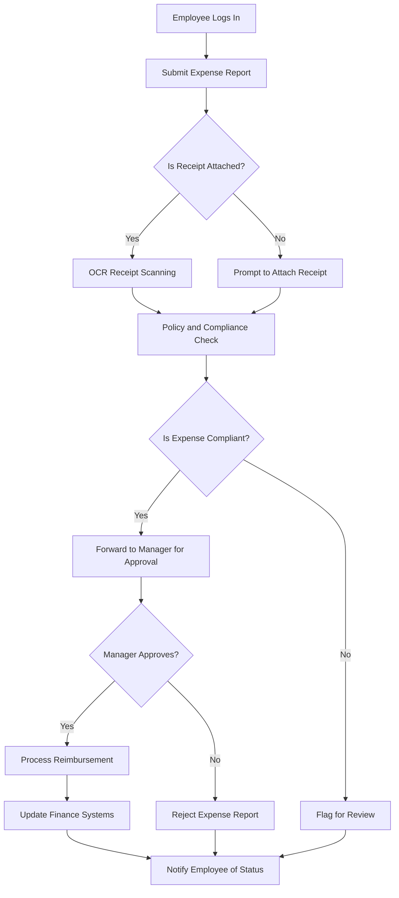
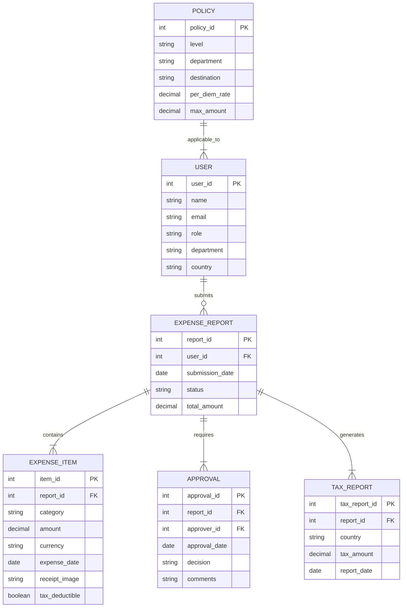
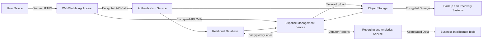

```markdown
## 1. Introduction

### 1.1 Purpose
The purpose of this Software Requirements Specification (SRS) document is to provide a comprehensive description of the Global Employee Travel Expense Tracking App. It serves as a guide for stakeholders, including developers, project managers, quality assurance teams, and other relevant personnel involved in the design, development, implementation, and maintenance of the application. This document aims to ensure a clear and shared understanding of the system’s functionalities, requirements, and constraints to facilitate successful project execution and delivery.

### 1.2 Scope
The Global Employee Travel Expense Tracking App is developed to streamline and optimize the management of employee travel expenses for multinational organizations. The application aims to achieve the following goals and benefits:

- **Simplified Expense Submission:** Enable employees to easily capture and submit travel expenses through a user-friendly mobile and web interface.
- **Compliance Assurance:** Automatically apply relevant international tax laws and company policies to ensure compliance across different countries and regions.
- **Efficient Approval Workflows:** Facilitate swift review and approval processes for managers, reducing bottlenecks and processing times.
- **Comprehensive Reporting and Analytics:** Provide finance teams with detailed insights and real-time visibility into travel expenses, supporting better budgeting and forecasting.
- **Seamless Integration:** Integrate seamlessly with existing accounting, HR, and payroll systems to ensure data consistency and reduce manual entry.
- **Enhanced User Experience:** Offer an intuitive and accessible user interface across multiple platforms, including cross-platform mobile support for iOS and Android devices.
- **Scalability and Reliability:** Ensure the application can scale to accommodate thousands of employees and maintain high availability with robust security measures.

Core functionalities of the application include secure user authentication, multi-currency support, OCR receipt scanning, policy and compliance engines, configurable approval workflows, automated reimbursement processing, and advanced tax compliance features. By addressing these areas, the app aims to improve the overall efficiency, accuracy, and transparency of the expense management process within global organizations.
```

```markdown
## 2. Product Description

### 2.1 Product Perspective
The Global Employee Travel Expense Tracking App is designed as a standalone application that integrates seamlessly with existing enterprise systems. It interfaces with accounting software (e.g., QuickBooks, SAP, Oracle Financials), HR systems for employee data synchronization, payroll systems, and identity providers for Single Sign-On (SSO). The app leverages cloud-based infrastructure to ensure scalability and reliability, supporting multinational corporations with thousands of employees. It also integrates with tax databases and currency exchange rate providers to handle international tax compliance and multi-currency transactions. The mobile and web platforms are built using the same technology stack to ensure consistent functionality and user experience across devices.

### 2.2 Product Functions
- **Expense Submission:** Allows employees to capture and submit travel expenses via mobile and web interfaces, utilizing OCR technology for receipt scanning and supporting multiple currencies.
- **Policy and Compliance Management:** Applies configurable expense policies and international tax laws in real-time during expense submission, flagging non-compliant entries.
- **Approval Workflow:** Facilitates multi-level approval processes with configurable workflows, batch approvals, and delegation of authority.
- **Reimbursement Processing:** Integrates with payroll systems to automate direct deposit reimbursements and supports multiple reimbursement methods.
- **Reporting and Analytics:** Provides customizable dashboards and detailed expense reports, enabling trend analysis, forecasting, and tax liability reporting.
- **User Management:** Manages user roles and access controls, ensuring secure authentication and authorization through SSO and MFA.
- **Tax Compliance:** Automatically identifies tax-deductible expenses, generates country-specific tax reports, and supports VAT/GST reclaim processes.
- **Mobile Features:** Offers cross-platform mobile support with offline data entry, push notifications, and a digital wallet for storing receipts and documents.

### 2.3 User Characteristics
- **Employees:** Regular users who travel for business purposes, requiring an intuitive interface for submitting expenses with minimal training.
- **Managers:** Users responsible for reviewing and approving expense reports, needing efficient tools for batch approvals and requesting additional information.
- **Finance Teams:** Users who manage reimbursements, generate reports, and analyze expense data, requiring access to detailed analytics and integration with financial systems.
- **HR Departments:** Users overseeing employee policies and compliance, needing administrative access to configure expense policies and manage user roles.
- **Administrators:** Users responsible for system configuration, managing integrations, and maintaining the overall functionality of the application.
- **C-level Executives:** Users monitoring overall travel expenses and financial health, requiring high-level dashboards and reporting tools.

### 2.4 Constraints
- **Regulatory Compliance:** Must adhere to international tax laws, financial data protection regulations (e.g., GDPR, CCPA), and data localization requirements in various countries.
- **Technical Limitations:** Relies on the availability and compatibility of integrated third-party systems (e.g., accounting software, HR systems).
- **Budgetary Constraints:** Development and maintenance must stay within allocated financial resources, potentially limiting feature expansion or infrastructure scaling.
- **Performance Requirements:** Must maintain app responsiveness with load times under 2 seconds and handle high volumes of concurrent users, especially during peak periods.
- **Security Standards:** Requires robust security measures, including end-to-end encryption, regular security audits, and secure storage of sensitive information.

### 2.5 Assumptions and Dependencies
- **Assumptions:**
  - Users have access to compatible devices (smartphones, tablets, desktops) with internet connectivity for using the app.
  - Integrated third-party systems (accounting, HR, payroll) have available APIs and support necessary for seamless integration.
  - Up-to-date tax databases and currency exchange rate providers are accessible and maintained regularly.
  - Employees are willing to adopt the new expense tracking system with adequate training and support.

- **Dependencies:**
  - Reliance on third-party services for OCR technology, tax compliance data, and currency exchange rates.
  - Dependence on cloud service providers for hosting and ensuring the scalability and reliability of the application.
  - Integration with company identity providers for SSO and multi-factor authentication.
  - Continuous updates and maintenance of integrated systems (accounting, HR, payroll) to ensure compatibility and functionality.
```

```markdown
## 3. Process Flowchart



```

```markdown
## 4. Functional Requirements

### 4.1 User Authentication and Authorization

- **ID:** FR-001
- **Description:** Manage secure user access and permissions within the application.
- **Priority:** High

| Requirement ID | Requirement Description                                                  | Priority |
|----------------|--------------------------------------------------------------------------|----------|
| FR-001.1       | Implement secure login process with multi-factor authentication (MFA)   | High     |
| FR-001.2       | Support Single Sign-On (SSO) integration with company identity providers | High     |
| FR-001.3       | Role-based access control for employees, managers, finance team, and administrators | High     |

### 4.2 Expense Submission

- **ID:** FR-002
- **Description:** Enable employees to capture and submit travel expenses efficiently.
- **Priority:** High

| Requirement ID | Requirement Description                                                                          | Priority |
|----------------|--------------------------------------------------------------------------------------------------|----------|
| FR-002.1       | Provide a mobile app for easy expense capture on-the-go                                         | High     |
| FR-002.2       | Utilize OCR technology for automatic receipt scanning and data extraction                       | High     |
| FR-002.3       | Support multiple currencies with real-time conversion                                           | High     |
| FR-002.4       | Allow attachment of digital receipts or photos of physical receipts                             | Medium   |
| FR-002.5       | Categorize expenses (e.g., meals, transportation, lodging)                                     | High     |
| FR-002.6       | Support recurring expenses                                                                       | Medium   |
| FR-002.7       | Implement mileage tracking with GPS integration                                                 | Medium   |
| FR-002.8       | Provide an offline mode for expense entry when internet connection is unavailable               | High     |

### 4.3 Policy and Compliance Management

- **ID:** FR-003
- **Description:** Ensure all expense submissions adhere to company policies and international tax laws.
- **Priority:** High

| Requirement ID | Requirement Description                                                                                  | Priority |
|----------------|----------------------------------------------------------------------------------------------------------|----------|
| FR-003.1       | Configure expense policies based on employee level, department, and travel destination                  | High     |
| FR-003.2       | Perform real-time policy checks during expense submission                                              | High     |
| FR-003.3       | Integrate with global tax databases to maintain up-to-date tax laws                                     | High     |
| FR-003.4       | Automatically apply per diem rates based on travel location                                            | Medium   |
| FR-003.5       | Flag expenses that exceed policy limits or require additional approval                                 | High     |

### 4.4 Approval Workflow

- **ID:** FR-004
- **Description:** Streamline the approval process for submitted expense reports.
- **Priority:** High

| Requirement ID | Requirement Description                                                                                            | Priority |
|----------------|--------------------------------------------------------------------------------------------------------------------|----------|
| FR-004.1       | Configure multi-level approval workflows                                                                           | High     |
| FR-004.2       | Enable batch approval capabilities for managers                                                                    | Medium   |
| FR-004.3       | Provide in-app notifications for pending approvals                                                                 | High     |
| FR-004.4       | Allow managers to request additional information or clarification on expenses                                     | Medium   |
| FR-004.5       | Support delegation of approval authority during manager absences                                                   | Medium   |

### 4.5 Reimbursement Processing

- **ID:** FR-005
- **Description:** Automate the reimbursement of approved expenses to employees.
- **Priority:** High

| Requirement ID | Requirement Description                                                                           | Priority |
|----------------|---------------------------------------------------------------------------------------------------|----------|
| FR-005.1       | Integrate with payroll systems for direct deposit reimbursements                                | High     |
| FR-005.2       | Support multiple reimbursement methods (e.g., payroll, separate bank transfer)                   | Medium   |
| FR-005.3       | Automatically generate expense reports for finance team review                                   | High     |
| FR-005.4       | Allow splitting of expenses between personal and corporate cards                                  | Low      |

### 4.6 Reporting and Analytics

- **ID:** FR-006
- **Description:** Provide comprehensive reporting and analytical tools for tracking and managing expenses.
- **Priority:** Medium

| Requirement ID | Requirement Description                                                                 | Priority |
|----------------|-----------------------------------------------------------------------------------------|----------|
| FR-006.1       | Offer customizable dashboards for different user roles                                 | Medium   |
| FR-006.2       | Generate detailed expense reports by employee, department, project, or cost center      | High     |
| FR-006.3       | Perform trend analysis for travel spending                                              | Medium   |
| FR-006.4       | Enable export capabilities in multiple formats (e.g., PDF, Excel, CSV)                 | Medium   |
| FR-006.5       | Provide tax liability reports for different jurisdictions                              | High     |
| FR-006.6       | Integrate with business intelligence tools                                              | Low      |

### 4.7 Tax Compliance Features

- **ID:** FR-007
- **Description:** Ensure all expenses comply with applicable tax regulations.
- **Priority:** High

| Requirement ID | Requirement Description                                               | Priority |
|----------------|-----------------------------------------------------------------------|----------|
| FR-007.1       | Automatically identify tax-deductible expenses                       | High     |
| FR-007.2       | Generate country-specific tax reports                                | High     |
| FR-007.3       | Support VAT/GST reclaim in applicable countries                     | Medium   |
| FR-007.4       | Track expenses subject to withholding tax                            | Medium   |
| FR-007.5       | Customize tax categories based on local regulations                  | High     |

### 4.8 Mobile Features

- **ID:** FR-008
- **Description:** Enhance the mobile experience for users on iOS and Android devices.
- **Priority:** Medium

| Requirement ID | Requirement Description                                                    | Priority |
|----------------|----------------------------------------------------------------------------|----------|
| FR-008.1       | Ensure cross-platform support for iOS and Android                         | High     |
| FR-008.2       | Implement push notifications for expense status updates and policy reminders | Medium   |
| FR-008.3       | Provide offline mode with data synchronization when online                | High     |
| FR-008.4       | Include a digital wallet for storing receipts and travel documents         | Medium   |
```

```markdown
## 5. Non-Functional Requirements

### 5.1 Performance

- **Response Time:** The application shall respond to all user interactions within 2 seconds under normal operating conditions.
- **Throughput:** The system shall handle up to 10,000 concurrent users during peak usage periods without degradation in performance.
- **Resource Utilization:** 
  - **Web Servers:** CPU utilization shall not exceed 75% under peak load.
  - **Mobile Applications:** Memory usage shall remain below 200MB on both iOS and Android devices.
- **Scalability:** The application architecture shall support horizontal scaling to manage increasing loads with minimal impact on response times.
- **Data Synchronization:** Synchronization between mobile and web platforms shall occur within 5 seconds of data submission or modification.

### 5.2 Safety

- **Data Integrity:** 
  - Implement transactional consistency to ensure that all data operations are completed accurately.
  - Conduct regular backups of all critical data with automated verification of backup integrity.
- **Failover Mechanism:** 
  - The system shall automatically switch to redundant servers within 30 seconds in the event of a primary server failure.
  - Ensure zero data loss during failover by maintaining real-time data replication.
- **Disaster Recovery:** 
  - Develop and maintain a disaster recovery plan that enables full system restoration within 4 hours of a catastrophic failure.
  - Perform quarterly disaster recovery drills to validate the effectiveness of recovery procedures.

### 5.3 Security

- **Authentication:**
  - Implement Multi-Factor Authentication (MFA) for all user logins.
  - Support Single Sign-On (SSO) integration with enterprise identity providers.
- **Authorization:**
  - Enforce Role-Based Access Control (RBAC) to ensure users have access only to functionalities and data pertinent to their roles.
- **Data Encryption:**
  - Utilize TLS 1.2 or higher for all data transmissions.
  - Encrypt sensitive data at rest using AES-256 encryption standards.
- **Privacy:**
  - Comply with GDPR, CCPA, and other relevant data privacy regulations.
  - Implement data anonymization techniques where applicable to protect user privacy.
- **Security Audits:**
  - Conduct annual security audits and regular penetration testing to identify and mitigate vulnerabilities.
  - Maintain a detailed log of all security incidents and response actions.

### 5.4 Quality

- **Availability:**
  - Ensure system availability of 99.9% uptime, excluding scheduled maintenance periods.
  - Implement load balancing and failover strategies to maintain high availability.
- **Maintainability:**
  - Design the application with a modular architecture to facilitate easy updates and maintenance.
  - Document all code and system architectures to support ongoing maintenance efforts.
- **Usability:**
  - Design an intuitive user interface that requires minimal training for end-users.
  - Ensure compliance with WCAG 2.1 accessibility standards to support users with disabilities.
  - Provide multi-language support to cater to a global user base.
- **Scalability:**
  - Architect the system to support horizontal scaling, allowing the addition of resources without significant downtime or performance loss.
- **Reliability:**
  - Implement robust error handling and logging mechanisms to ensure reliable operation.
  - Achieve a Mean Time Between Failures (MTBF) of at least 1,000 hours.

### 5.5 Compliance

- **Regulatory Compliance:**
  - Adhere to international accounting standards such as GAAP and IFRS.
  - Comply with financial data protection regulations including GDPR and CCPA.
- **Data Localization:**
  - Ensure data is stored and processed within the geographical boundaries required by local laws.
  - Implement mechanisms to segregate and manage data based on regional data residency requirements.
- **Audit Trails:**
  - Maintain comprehensive audit logs for all user actions and system changes.
  - Ensure audit trails are tamper-proof and retained for a minimum of seven years to support regulatory audits.
- **Standards Compliance:**
  - Follow industry best practices and standards for software development, such as ISO/IEC 27001 for information security management.
  - Ensure compliance with accessibility standards to support users with disabilities.

```

```markdown
## 6. Data Requirements

### 6.1 Data Models

The data model for the Global Employee Travel Expense Tracking App is designed to ensure efficient data management, scalability, and compliance with international regulations. Below is the Entity-Relationship Diagram (ERD) illustrating the primary data entities and their relationships.



### 6.2 Data Storage

#### Data Storage Architecture

The application utilizes a cloud-based storage solution to ensure scalability, reliability, and security. The primary components include:

- **Database:** A relational database (e.g., PostgreSQL) for transactional data such as user information, expense reports, and approval workflows.
- **Object Storage:** A secure object storage service (e.g., AWS S3, Azure Blob Storage) for storing receipts, digital documents, and backups.

#### Data Retention

- **Expense Reports:** Retained for a minimum of seven years to comply with regulatory and tax requirements.
- **User Data:** Retained for the duration of employment and an additional five years post-employment.
- **Audit Logs:** Maintained indefinitely to support ongoing compliance and auditing needs.

#### Redundancy and Backup

- **Data Redundancy:** 
  - **Primary and Secondary Replicas:** Implement database replication across multiple availability zones to ensure high availability and fault tolerance.
  - **Geographical Redundancy:** Store backups in geographically diverse locations to protect against regional outages.
- **Backup Strategies:**
  - **Automated Daily Backups:** Perform daily automated backups of the database with versioning to allow point-in-time recovery.
  - **Incremental Backups:** Utilize incremental backups throughout the day to minimize data loss in case of a failure.
  - **Snapshot Management:** Regular snapshots of object storage data to enable quick restoration of receipts and documents.

#### Recovery at Scale

- **Disaster Recovery Plan:** 
  - **Recovery Time Objective (RTO):** 4 hours for full system restoration.
  - **Recovery Point Objective (RPO):** 15 minutes to ensure minimal data loss.
- **Scalable Infrastructure:** Leverage cloud infrastructure that can scale horizontally to handle increased load during recovery processes.
- **Automated Failover:** Implement automated failover mechanisms to switch to backup systems seamlessly in the event of a primary system failure.

### 6.3 Data Processing

#### Data Security

- **Encryption:**
  - **Data in Transit:** All data transmitted between clients and servers is encrypted using TLS 1.2 or higher.
  - **Data at Rest:** Sensitive data stored in databases and object storage is encrypted using AES-256 standards.
- **Access Controls:**
  - **Role-Based Access Control (RBAC):** Enforce strict RBAC policies to ensure users can only access data pertinent to their roles.
  - **Least Privilege Principle:** Grant the minimum level of access required for users to perform their duties.
- **Data Anonymization:** Implement data anonymization techniques for reporting and analytics to protect user privacy where applicable.
- **Regular Security Audits:** Conduct quarterly security audits and annual penetration testing to identify and mitigate vulnerabilities.

#### Data Flow

The following Data Flow Diagram (DFD) illustrates how data moves through the system, highlighting security measures at each stage.



```markdown
## EXTERNAL INTERFACES

### USER INTERFACES

The Global Employee Travel Expense Tracking App will provide intuitive and consistent user interfaces across all supported platforms to ensure ease of use and accessibility.

- **Web Interface:**
  - Responsive design compatible with major browsers (Chrome, Firefox, Safari, Edge).
  - Dashboard for employees to submit and track expense reports.
  - Manager interface for reviewing and approving expenses.
  - Finance team interface for generating reports and managing reimbursements.
  - **Mockup Placeholder:** 

- **Mobile Interface:**
  - Native applications for iOS and Android platforms.
  - Simplified navigation for expense submission, receipt capture, and status tracking.
  - Push notifications for approval requests and reimbursement updates.
  - **Mockup Placeholder:** 

- **Administrator Interface:**
  - Web-based portal for system configuration and user management.
  - Tools for defining expense policies, managing integrations, and configuring approval workflows.
  - **Mockup Placeholder:** 

### SOFTWARE INTERFACES

The application will interact with various external software systems to ensure seamless integration and data consistency.

- **Accounting Software:**
  - **Systems:** QuickBooks, SAP, Oracle Financials
  - **Interface:** RESTful APIs for data synchronization of expense reports and reimbursement transactions.
  - **Authentication:** OAuth 2.0 for secure API access.

- **HR Systems:**
  - **Systems:** Workday, SAP SuccessFactors
  - **Interface:** API-based integration for employee data synchronization, including roles, departments, and status updates.
  - **Authentication:** Secure API keys and OAuth 2.0.

- **Payroll Systems:**
  - **Systems:** ADP, Paychex
  - **Interface:** Direct API integration for processing reimbursements and updating payroll records.
  - **Authentication:** Encrypted credentials and OAuth 2.0.

- **Identity Providers:**
  - **Providers:** Okta, Microsoft Azure AD
  - **Interface:** SAML 2.0 and OpenID Connect for Single Sign-On (SSO) and authentication.
  - **Authentication:** SAML assertions and JWT tokens.

- **Tax Databases and Calculation Engines:**
  - **Services:** Avalara, TaxJar
  - **Interface:** API integration for real-time tax rate retrieval and compliance checks.
  - **Authentication:** API keys and secure tokens.

- **Currency Exchange Rate Providers:**
  - **Providers:** OpenExchangeRates, CurrencyLayer
  - **Interface:** RESTful APIs for fetching current exchange rates.
  - **Authentication:** API keys.

### COMMUNICATION INTERFACES

The application will utilize standardized communication protocols and data formats to ensure secure and efficient data exchange.

- **Protocols:**
  - **HTTPS:** All data transmissions between clients and servers will use HTTPS to ensure data integrity and security.
  - **REST:** RESTful APIs will be used for interactions with external software systems and internal services.
  
- **Data Formats:**
  - **JSON:** Primary data format for API requests and responses due to its lightweight and easy-to-parse nature.
  - **XML:** Supported for systems that require XML-based data exchange.
  
- **Authentication Methods:**
  - **OAuth 2.0:** For secure authorization with third-party services and integrations.
  - **API Keys:** Used for authenticating requests to internal and external APIs where OAuth is not applicable.
  
- **Webhooks:**
  - **Usage:** Real-time notifications for events such as expense report submissions, approval actions, and reimbursement completions.
  - **Configuration:** Endpoints can be configured in the admin portal to subscribe to specific events.
  
- **Data Encryption:**
  - **In Transit:** TLS 1.2 or higher to encrypt all data transmitted over the network.
  - **At Rest:** AES-256 encryption for sensitive data stored in databases and object storage.

```

```markdown
## APPENDICES

### Success Metrics

- **Reduction in Time Spent on Expense Reporting:** Measure the decrease in average time employees take to submit expense reports compared to the previous system.
- **Policy Compliance Rate:** Track the percentage of submitted expenses that comply with company policies.
- **Reimbursement Processing Time:** Measure the average time taken to process reimbursements from approval to payment.
- **Tax Calculation Accuracy:** Monitor the accuracy rate of tax calculations and reporting to ensure compliance.
- **User Satisfaction Scores:** Collect feedback from employees, managers, and administrators to gauge the ease of use and overall satisfaction with the application.
- **Adoption Rate:** Track the number of users actively using the app versus total eligible users.

### Risks and Mitigation Strategies

- **Data Privacy Concerns:**
  - *Risk:* Unauthorized access to sensitive financial and personal data.
  - *Mitigation:* Implement robust encryption, access controls, and regular security audits to protect data integrity and privacy.
  
- **Complexity of International Tax Laws:**
  - *Risk:* Difficulty in maintaining up-to-date compliance with varying international tax regulations.
  - *Mitigation:* Partner with tax experts and integrate with reliable tax databases to ensure accurate and current tax compliance.
  
- **User Adoption Challenges:**
  - *Risk:* Employees and managers may resist adopting the new system.
  - *Mitigation:* Develop an intuitive user interface, provide comprehensive training, and offer ongoing support to encourage adoption.
  
- **Integration Difficulties:**
  - *Risk:* Challenges in integrating with existing accounting, HR, and payroll systems.
  - *Mitigation:* Utilize flexible APIs and establish strong partnerships with key software providers to ensure seamless integration.
  
- **System Downtime:**
  - *Risk:* Unplanned downtime affecting user access and expense processing.
  - *Mitigation:* Implement high-availability infrastructure, automated failover mechanisms, and proactive monitoring to minimize downtime.
  
- **Scalability Issues:**
  - *Risk:* Application performance degrading as the user base grows.
  - *Mitigation:* Design the system for horizontal scalability and conduct regular performance testing to ensure the application can handle increased load.

### GLOSSARY

| Term | Definition |
|------|------------|
| MFA | Multi-Factor Authentication: A security system that requires multiple methods of authentication to verify a user's identity. |
| SSO | Single Sign-On: An authentication process that allows a user to access multiple applications with one set of login credentials. |
| OCR | Optical Character Recognition: Technology that converts different types of documents, such as scanned paper documents or PDFs, into editable and searchable data. |
| RBAC | Role-Based Access Control: A method of regulating access to computer or network resources based on the roles of individual users within an organization. |
| SLA | Service Level Agreement: A contract between a service provider and a client that specifies the level of service expected during its term. |
| MTBF | Mean Time Between Failures: A measure of how reliable a hardware product or component is, calculated as the average time between failures. |
| GDPR | General Data Protection Regulation: A regulation in EU law on data protection and privacy. |
| CCPA | California Consumer Privacy Act: A state statute intended to enhance privacy rights and consumer protection for residents of California, USA. |
| VP | Vendor Protocol: Protocols used for communication between the client and the service provider in a vendor's software. |

### ACRONYMS

| Acronym | Expanded Form |
|---------|---------------|
| MFA | Multi-Factor Authentication |
| SSO | Single Sign-On |
| OCR | Optical Character Recognition |
| RBAC | Role-Based Access Control |
| SLA | Service Level Agreement |
| MTBF | Mean Time Between Failures |
| GDPR | General Data Protection Regulation |
| CCPA | California Consumer Privacy Act |
| VP | Vendor Protocol |

### ADDITIONAL REFERENCES

- [GDPR Compliance Guidelines](https://gdpr.eu/)
- [CCPA Official Text](https://oag.ca.gov/privacy/ccpa)
- [ISO/IEC 27001 Information Security Management](https://www.iso.org/isoiec-27001-information-security.html)
- [WCAG 2.1 Accessibility Standards](https://www.w3.org/TR/WCAG21/)
- [OAuth 2.0 Specification](https://oauth.net/2/)
- [RESTful API Best Practices](https://restfulapi.net/best-practices/)
```