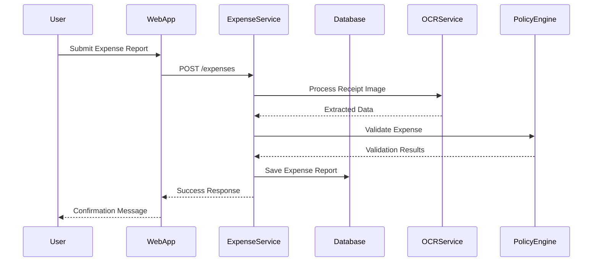
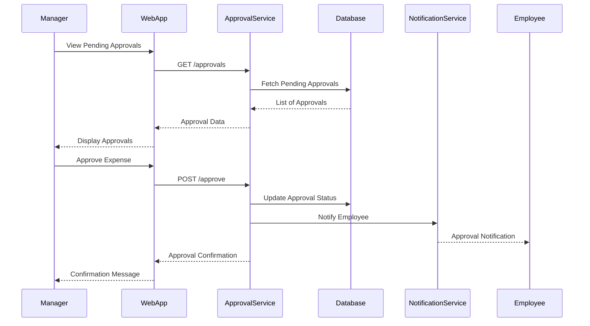
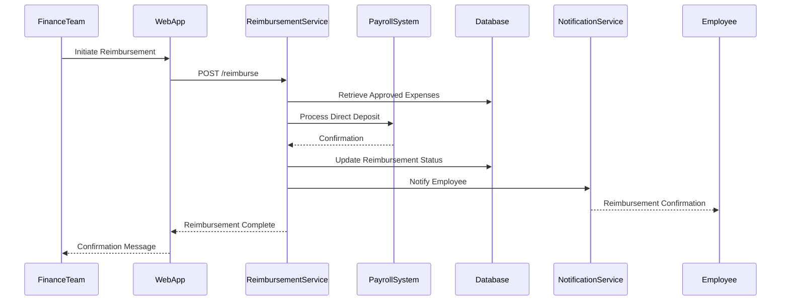
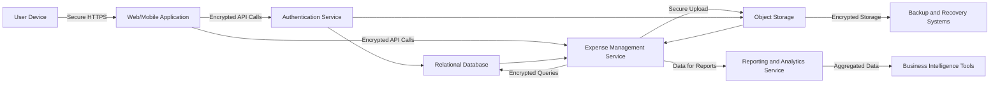
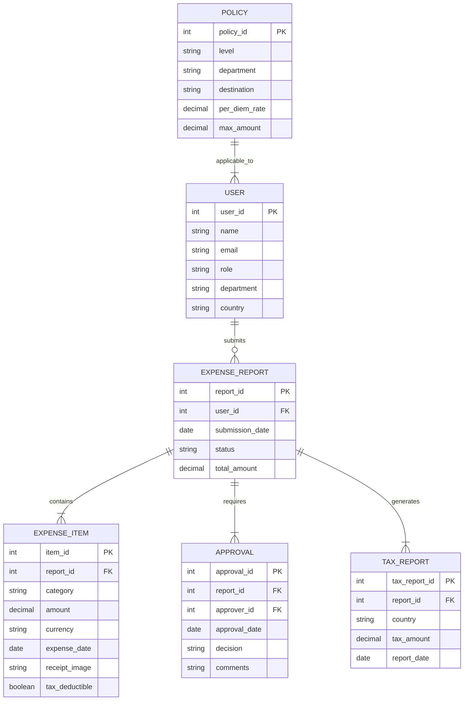
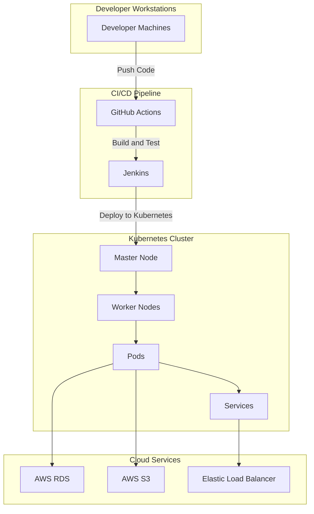
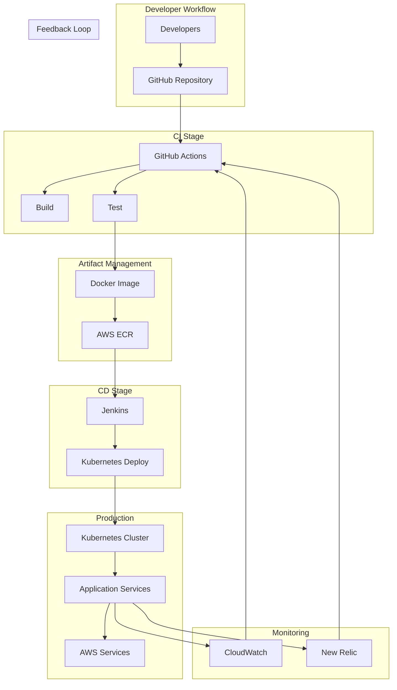

## 1. Introduction

### 1.3 System Objectives

The Global Employee Travel Expense Tracking App aims to achieve the following high-level objectives:

| **Objective**                                       | **Description**                                                                                     |
|-----------------------------------------------------|-----------------------------------------------------------------------------------------------------|
| **Simplify Expense Management**                     | Streamline the process of submitting, approving, and managing travel expenses for employees.        |
| **Ensure Compliance**                               | Automatically enforce international tax laws and company-specific expense policies.                 |
| **Enhance Efficiency**                              | Reduce processing time and minimize errors in expense reporting and reimbursement workflows.        |
| **Provide Financial Visibility**                    | Offer real-time insights and comprehensive analytics to support budgeting and forecasting efforts.  |
| **Seamless Integration**                            | Integrate effortlessly with existing accounting, HR, and payroll systems to ensure data consistency.|
| **Improve User Experience**                         | Deliver an intuitive and user-friendly interface across web and mobile platforms for all user roles.|

### 1.4 Scope

The Global Employee Travel Expense Tracking App encompasses a comprehensive suite of features and functionalities designed to optimize the management of employee travel expenses within multinational organizations. The scope of the application includes:

- **Expense Submission:** 
  - Enables employees to capture and submit travel expenses through both mobile and web interfaces.
  - Utilizes OCR technology for automatic receipt scanning and supports multiple currencies with real-time conversion.

- **Policy and Compliance Enforcement:** 
  - Applies configurable expense policies based on employee roles, departments, and travel destinations.
  - Integrates with up-to-date international tax databases to ensure compliance with varying tax regulations.

- **Approval Workflows:** 
  - Facilitates multi-level approval processes with configurable workflows to accommodate organizational hierarchies.
  - Provides batch approval capabilities and delegation options for managers.

- **Reimbursement Processing:** 
  - Automates the reimbursement of approved expenses through integration with payroll systems.
  - Supports multiple reimbursement methods, including direct deposit and separate bank transfers.

- **Reporting and Analytics:** 
  - Offers customizable dashboards and detailed expense reports for different user roles, including finance teams and executives.
  - Provides trend analysis, forecasting, and tax liability reporting to support informed financial decisions.

- **System Integrations:** 
  - Seamlessly connects with existing accounting software (e.g., QuickBooks, SAP), HR systems, payroll systems, and identity providers for SSO.
  - Incorporates integration with tax calculation engines and currency exchange rate providers to handle international transactions.

- **Mobile Features:** 
  - Ensures cross-platform support with native applications for iOS and Android.
  - Includes offline data entry capabilities, push notifications, and a digital wallet for storing receipts and travel documents.

- **Security and Compliance:** 
  - Implements robust security measures, including end-to-end encryption, multi-factor authentication, and role-based access control.
  - Complies with international data protection regulations such as GDPR and CCPA, ensuring data privacy and integrity.

- **Scalability and Reliability:** 
  - Built on a cloud-based infrastructure to support scalability for large multinational corporations.
  - Ensures high availability with a 99.9% uptime SLA and robust disaster recovery processes.

The application is designed to enhance the efficiency and accuracy of expense management processes, provide comprehensive financial insights, and ensure compliance with complex international tax laws, thereby supporting the operational and financial objectives of global organizations.

```markdown
## 13. Features

### 13.1 User Authentication and Authorization

- **ID:** F-001
- **Description:** 
  Manage secure user access and permissions within the application, ensuring that only authorized users can perform specific actions based on their roles.
- **Priority:** High

#### Technical Requirements

| Requirement ID | Description                                                     | Priority |
|----------------|-----------------------------------------------------------------|----------|
| TR-F001.1      | Implement secure login process with multi-factor authentication (MFA) | High     |
| TR-F001.2      | Support Single Sign-On (SSO) integration with company identity providers | High     |
| TR-F001.3      | Role-based access control for employees, managers, finance team, and administrators | High     |

---

### 13.2 Expense Submission

- **ID:** F-002
- **Description:** 
  Enable employees to efficiently capture and submit travel expenses through user-friendly mobile and web interfaces, incorporating automated data extraction and currency support.
- **Priority:** High

#### Technical Requirements

| Requirement ID | Description                                                     | Priority |
|----------------|-----------------------------------------------------------------|----------|
| TR-F002.1      | Provide a mobile app for easy expense capture on-the-go        | High     |
| TR-F002.2      | Utilize OCR technology for automatic receipt scanning and data extraction | High     |
| TR-F002.3      | Support multiple currencies with real-time conversion           | High     |
| TR-F002.4      | Allow attachment of digital receipts or photos of physical receipts | Medium   |
| TR-F002.5      | Categorize expenses (e.g., meals, transportation, lodging)     | High     |
| TR-F002.6      | Support recurring expenses                                       | Medium   |
| TR-F002.7      | Implement mileage tracking with GPS integration                 | Medium   |
| TR-F002.8      | Provide an offline mode for expense entry when internet connection is unavailable | High     |

---

### 13.3 Policy and Compliance Engine

- **ID:** F-003
- **Description:** 
  Ensure all expense submissions adhere to company policies and international tax laws through configurable rules and real-time validation.
- **Priority:** High

#### Technical Requirements

| Requirement ID | Description                                                     | Priority |
|----------------|-----------------------------------------------------------------|----------|
| TR-F003.1      | Configure expense policies based on employee level, department, and travel destination | High     |
| TR-F003.2      | Perform real-time policy checks during expense submission        | High     |
| TR-F003.3      | Integrate with global tax databases to maintain up-to-date tax laws | High     |
| TR-F003.4      | Automatically apply per diem rates based on travel location      | Medium   |
| TR-F003.5      | Flag expenses that exceed policy limits or require additional approval | High     |

---

### 13.4 Approval Workflow

- **ID:** F-004
- **Description:** 
  Streamline the approval process for submitted expense reports with configurable workflows, batch processing, and delegation capabilities.
- **Priority:** High

#### Technical Requirements

| Requirement ID | Description                                                     | Priority |
|----------------|-----------------------------------------------------------------|----------|
| TR-F004.1      | Configure multi-level approval workflows                        | High     |
| TR-F004.2      | Enable batch approval capabilities for managers                 | Medium   |
| TR-F004.3      | Provide in-app notifications for pending approvals              | High     |
| TR-F004.4      | Allow managers to request additional information or clarification on expenses | Medium   |
| TR-F004.5      | Support delegation of approval authority during manager absences | Medium   |

---

### 13.5 Reimbursement Processing

- **ID:** F-005
- **Description:** 
  Automate the reimbursement process for approved expenses, integrating seamlessly with payroll systems and supporting multiple payment methods.
- **Priority:** High

#### Technical Requirements

| Requirement ID | Description                                                     | Priority |
|----------------|-----------------------------------------------------------------|----------|
| TR-F005.1      | Integrate with payroll systems for direct deposit reimbursements | High     |
| TR-F005.2      | Support multiple reimbursement methods (e.g., payroll, separate bank transfer) | Medium   |
| TR-F005.3      | Automatically generate expense reports for finance team review | High     |
| TR-F005.4      | Allow splitting of expenses between personal and corporate cards | Low      |

---

### 13.6 Reporting and Analytics

- **ID:** F-006
- **Description:** 
  Provide comprehensive reporting and analytical tools for tracking, managing, and forecasting expenses, tailored to different user roles.
- **Priority:** Medium

#### Technical Requirements

| Requirement ID | Description                                                     | Priority |
|----------------|-----------------------------------------------------------------|----------|
| TR-F006.1      | Offer customizable dashboards for different user roles          | Medium   |
| TR-F006.2      | Generate detailed expense reports by employee, department, project, or cost center | High     |
| TR-F006.3      | Perform trend analysis for travel spending                      | Medium   |
| TR-F006.4      | Enable export capabilities in multiple formats (e.g., PDF, Excel, CSV) | Medium   |
| TR-F006.5      | Provide tax liability reports for different jurisdictions      | High     |
| TR-F006.6      | Integrate with business intelligence tools                      | Low      |

---

### 13.7 Tax Compliance Features

- **ID:** F-007
- **Description:** 
  Ensure all expenses comply with applicable tax regulations by automatically identifying deductible expenses and generating necessary tax reports.
- **Priority:** High

#### Technical Requirements

| Requirement ID | Description                                                     | Priority |
|----------------|-----------------------------------------------------------------|----------|
| TR-F007.1      | Automatically identify tax-deductible expenses                 | High     |
| TR-F007.2      | Generate country-specific tax reports                          | High     |
| TR-F007.3      | Support VAT/GST reclaim in applicable countries               | Medium   |
| TR-F007.4      | Track expenses subject to withholding tax                      | Medium   |
| TR-F007.5      | Customize tax categories based on local regulations            | High     |

---

### 13.8 Mobile Features

- **ID:** F-008
- **Description:** 
  Enhance the mobile experience for users on iOS and Android devices, providing essential functionalities and ensuring usability even in offline scenarios.
- **Priority:** Medium

#### Technical Requirements

| Requirement ID | Description                                                     | Priority |
|----------------|-----------------------------------------------------------------|----------|
| TR-F008.1      | Ensure cross-platform support for iOS and Android               | High     |
| TR-F008.2      | Implement push notifications for expense status updates and policy reminders | Medium   |
| TR-F008.3      | Provide offline mode with data synchronization when online      | High     |
| TR-F008.4      | Include a digital wallet for storing receipts and travel documents | Medium   |
```

```markdown
## SYSTEM ARCHITECTURE

### 1. High-Level Architecture Diagram

```mermaid
graph TD
    subgraph Client Layer
        A[Web Application] 
        B[Mobile Application (iOS & Android)]
    end

    subgraph API Layer
        C[Authentication Service]
        D[Expense Management Service]
        E[Approval Workflow Service]
        F[Reimbursement Processing Service]
        G[Reporting and Analytics Service]
    end

    subgraph Data Layer
        H[Relational Database (PostgreSQL)]
        I[Object Storage (AWS S3)]
    end

    subgraph Integration Layer
        J[Accounting Systems (QuickBooks, SAP, Oracle)]
        K[HR Systems (Workday, SAP SuccessFactors)]
        L[Payroll Systems (ADP, Paychex)]
        M[Tax Databases (Avalara, TaxJar)]
        N[Currency Exchange Providers (OpenExchangeRates, CurrencyLayer)]
    end

    subgraph Security Layer
        O[OAuth 2.0]
        P[SAML 2.0]
        Q[MFA]
        R[RBAC]
        S[Data Encryption (TLS 1.2+, AES-256)]
    end

    A & B -->|HTTPS| C
    C -->|OAuth 2.0 / SAML 2.0| H
    C --> D
    C --> E
    C --> F
    C --> G
    D --> H
    D --> I
    E --> H
    F --> H
    G --> H
    G --> I
    D --> J
    D --> K
    F --> L
    D --> M
    D --> N
    C --> Q
    C --> R
    C --> S
    J -.-> S
    K -.-> S
    L -.-> S
    M -.-> S
    N -.-> S
```

### 2. Component Descriptions

#### 2.1 Client Layer

- **Web Application**
  - **Description:** A responsive web interface accessible via major browsers, allowing users to submit expenses, track statuses, and access reports.
  - **Technologies:** React.js, HTML5, CSS3

- **Mobile Application (iOS & Android)**
  - **Description:** Native applications providing on-the-go expense submission, receipt capture, and real-time notifications.
  - **Technologies:** React Native, Swift (iOS), Kotlin (Android)

#### 2.2 API Layer

- **Authentication Service**
  - **Description:** Handles user authentication and authorization using OAuth 2.0 and SAML 2.0 protocols, supporting Single Sign-On (SSO) and Multi-Factor Authentication (MFA).
  - **Technologies:** Node.js, Express.js, OAuth 2.0, SAML 2.0

- **Expense Management Service**
  - **Description:** Manages the core functionalities of expense submission, receipt processing, and policy enforcement.
  - **Technologies:** Node.js, Express.js

- **Approval Workflow Service**
  - **Description:** Facilitates configurable multi-level approval workflows, including batch approvals and delegation.
  - **Technologies:** Node.js, Express.js

- **Reimbursement Processing Service**
  - **Description:** Automates the reimbursement process by integrating with payroll systems and handling multiple payment methods.
  - **Technologies:** Node.js, Express.js

- **Reporting and Analytics Service**
  - **Description:** Generates customizable dashboards and detailed reports, providing insights and trend analysis for finance teams and executives.
  - **Technologies:** Node.js, Express.js, Business Intelligence Tools

#### 2.3 Data Layer

- **Relational Database (PostgreSQL)**
  - **Description:** Stores all transactional data, including user information, expense reports, approval workflows, and audit logs.
  - **Technologies:** PostgreSQL, AWS RDS

- **Object Storage (AWS S3)**
  - **Description:** Securely stores receipts, digital documents, and backups with high availability and durability.
  - **Technologies:** AWS S3

#### 2.4 Integration Layer

- **Accounting Systems Integration**
  - **Description:** Syncs expense and reimbursement data with accounting software like QuickBooks, SAP, and Oracle Financials via RESTful APIs.
  - **Technologies:** RESTful APIs, OAuth 2.0

- **HR Systems Integration**
  - **Description:** Synchronizes employee data, roles, and departments with HR systems such as Workday and SAP SuccessFactors.
  - **Technologies:** RESTful APIs, Secure API Keys

- **Payroll Systems Integration**
  - **Description:** Facilitates direct deposit reimbursements and updates payroll records through integrations with systems like ADP and Paychex.
  - **Technologies:** RESTful APIs, OAuth 2.0

- **Tax Databases Integration**
  - **Description:** Retrieves real-time tax rates and ensures compliance by integrating with tax services like Avalara and TaxJar.
  - **Technologies:** RESTful APIs, Secure Tokens

- **Currency Exchange Rate Providers Integration**
  - **Description:** Fetches current exchange rates for multi-currency support from providers like OpenExchangeRates and CurrencyLayer.
  - **Technologies:** RESTful APIs, API Keys

#### 2.5 Security Layer

- **OAuth 2.0 & SAML 2.0**
  - **Description:** Provides secure authentication and authorization mechanisms, enabling SSO and integration with enterprise identity providers.
  
- **Multi-Factor Authentication (MFA)**
  - **Description:** Enhances security by requiring multiple forms of verification during user login.

- **Role-Based Access Control (RBAC)**
  - **Description:** Ensures users have access only to functionalities and data pertinent to their roles within the organization.

- **Data Encryption**
  - **Description:** Protects data in transit and at rest using TLS 1.2+ for encryption during transmission and AES-256 for data storage.

### 3. Technology Stack

| Layer            | Technologies                                    |
|------------------|-------------------------------------------------|
| **Frontend**     | React.js (Web), React Native, Swift, Kotlin     |
| **Backend**      | Node.js, Express.js                             |
| **Database**     | PostgreSQL, AWS RDS                              |
| **Storage**      | AWS S3                                           |
| **Authentication** | OAuth 2.0, SAML 2.0, MFA, RBAC                 |
| **APIs**         | RESTful APIs                                     |
| **Cloud Services** | AWS (EC2, RDS, S3)                              |
| **Integration**  | RESTful APIs, OAuth 2.0, SAML 2.0, Secure API Keys |

### 4. Deployment Architecture

```mermaid
graph LR
    subgraph AWS Cloud
        EC2[EC2 Instances] 
        RDS[(PostgreSQL Database)]
        S3[AWS S3 Storage]
        ELB[Elastic Load Balancer]
    end

    subgraph External Systems
        QuickBooks
        SAP
        OracleFinancials
        Workday
        SAPSuccessFactors
        ADP
        Paychex
        Avalara
        TaxJar
        OpenExchangeRates
        CurrencyLayer
        Okta
        AzureAD
    end

    Clients[Users (Web & Mobile)] -->|HTTPS| ELB
    ELB --> EC2
    EC2 --> RDS
    EC2 --> S3
    EC2 --> QuickBooks
    EC2 --> SAP
    EC2 --> OracleFinancials
    EC2 --> Workday
    EC2 --> SAPSuccessFactors
    EC2 --> ADP
    EC2 --> Paychex
    EC2 --> Avalara
    EC2 --> TaxJar
    EC2 --> OpenExchangeRates
    EC2 --> CurrencyLayer
    EC2 --> Okta
    EC2 --> AzureAD
```

### 5. Component Interactions

- **User Interactions:**
  - Users access the application via web browsers or mobile devices. All client requests are routed through the Elastic Load Balancer (ELB) to ensure optimal resource distribution and high availability.

- **Authentication Flow:**
  - The Authentication Service manages user logins, leveraging OAuth 2.0 and SAML 2.0 for secure and seamless Single Sign-On (SSO) experiences. MFA is enforced to enhance security.

- **Expense Submission and Management:**
  - When a user submits an expense, the Expense Management Service processes the data, interacts with the Relational Database for storage, and utilizes OCR technology for receipt scanning. Real-time policy checks are performed to ensure compliance.

- **Approval Workflow:**
  - Submitted expenses are routed through the Approval Workflow Service, which manages multi-level approvals, batch processing, and delegation. Notifications are sent to managers for pending approvals.

- **Reimbursement Processing:**
  - Approved expenses are handled by the Reimbursement Processing Service, which integrates with Payroll Systems to automate direct deposits and manage multiple reimbursement methods.

- **Reporting and Analytics:**
  - The Reporting and Analytics Service aggregates data from the Relational Database and Object Storage to generate customizable dashboards and detailed reports for finance teams and executives.

- **External Integrations:**
  - The system interfaces with Accounting Systems, HR Systems, Payroll Systems, Tax Databases, and Currency Exchange Providers through secure RESTful APIs, ensuring data consistency and real-time updates.

- **Data Security:**
  - All data transmissions are encrypted using TLS 1.2+, and sensitive data at rest is secured with AES-256 encryption. Role-Based Access Control (RBAC) ensures that users have appropriate access permissions based on their roles.

### 6. Scalability and Redundancy

- **Scalability:**
  - The system is designed with horizontal scalability in mind, allowing the addition of more EC2 instances behind the Elastic Load Balancer to handle increased load without impacting performance.

- **Redundancy:**
  - Critical components such as the Relational Database and Object Storage are replicated across multiple availability zones to ensure high availability and fault tolerance. Automated backups and disaster recovery plans are in place to minimize downtime and data loss.

### 7. Security Considerations

- **Data Protection:**
  - Comprehensive encryption strategies (TLS 1.2+ for data in transit and AES-256 for data at rest) are implemented to protect sensitive information.

- **Access Control:**
  - RBAC ensures that users can only access functionalities and data necessary for their roles. MFA adds an additional layer of security during authentication.

- **Compliance:**
  - The architecture adheres to international data protection regulations such as GDPR and CCPA, with data localization and anonymization techniques applied where necessary.

### 8. Technology Alignment

The chosen technology stack aligns with the existing system requirements and integrations outlined in previous sections, ensuring seamless interoperability and adherence to performance, security, and scalability standards.

```

```markdown
## SYSTEM COMPONENTS

### Component Diagrams

```mermaid
graph TD
    subgraph Client Layer
        A[Web Application]
        B[Mobile Application (iOS & Android)]
    end

    subgraph API Layer
        C[Authentication Service]
        D[Expense Management Service]
        E[Approval Workflow Service]
        F[Reimbursement Processing Service]
        G[Reporting and Analytics Service]
    end

    subgraph Data Layer
        H[Relational Database (PostgreSQL)]
        I[Object Storage (AWS S3)]
    end

    subgraph Integration Layer
        J[Accounting Systems (QuickBooks, SAP, Oracle)]
        K[HR Systems (Workday, SAP SuccessFactors)]
        L[Payroll Systems (ADP, Paychex)]
        M[Tax Databases (Avalara, TaxJar)]
        N[Currency Exchange Providers (OpenExchangeRates, CurrencyLayer)]
    end

    subgraph Security Layer
        O[OAuth 2.0]
        P[SAML 2.0]
        Q[MFA]
        R[RBAC]
        S[Data Encryption (TLS 1.2+, AES-256)]
    end

    A & B -->|HTTPS| C
    C -->|OAuth 2.0 / SAML 2.0| H
    C --> D
    C --> E
    C --> F
    C --> G
    D --> H
    D --> I
    E --> H
    F --> H
    G --> H
    G --> I
    D --> J
    D --> K
    F --> L
    D --> M
    D --> N
    C --> Q
    C --> R
    C --> S
    J -.-> S
    K -.-> S
    L -.-> S
    M -.-> S
    N -.-> S
```

### Sequence Diagrams

#### Scenario 1: Expense Submission



#### Scenario 2: Approval Workflow



#### Scenario 3: Reimbursement Processing



### Data-Flow Diagram



```

```markdown
## SYSTEM DESIGN

### Programming Languages

| **Platform**       | **Language**         | **Justification**                                                                                     |
|--------------------|----------------------|-------------------------------------------------------------------------------------------------------|
| **Web Frontend**   | JavaScript (ES6+) with React.js | React.js offers a component-based architecture, facilitating reusable UI components and efficient state management, which aligns with the requirement for an intuitive and responsive web interface. |
| **Mobile Frontend**| JavaScript with React Native,<br>Swift (iOS),<br>Kotlin (Android) | React Native enables cross-platform mobile development, reducing development time and ensuring consistency across iOS and Android. Swift and Kotlin are used for platform-specific enhancements to leverage native functionalities and optimize performance where necessary. |
| **Backend**        | JavaScript with Node.js and Express.js | Node.js provides a non-blocking, event-driven architecture suitable for handling multiple concurrent requests efficiently. Express.js simplifies the creation of RESTful APIs, aligning with the system's integration and scalability requirements. |
| **Database Scripting** | SQL (PostgreSQL) | PostgreSQL's robust support for complex queries and transactions is essential for managing relational data efficiently, ensuring data integrity and consistency across the application. |
| **Scripting and Automation** | Python | Python may be used for data processing tasks such as OCR receipt scanning and integration with external tax databases due to its rich ecosystem of libraries and ease of scripting. |

### Database Design

#### Entity-Relationship Diagram



#### Tables and Relationships

| **Table**        | **Columns**                                                                                     | **Description**                                                                 |
|------------------|--------------------------------------------------------------------------------------------------|---------------------------------------------------------------------------------|
| **USER**         | - `user_id` (PK)<br>- `name`<br>- `email`<br>- `role`<br>- `department`<br>- `country`           | Stores user information, including roles and departments for access control.   |
| **EXPENSE_REPORT** | - `report_id` (PK)<br>- `user_id` (FK)<br>- `submission_date`<br>- `status`<br>- `total_amount` | Represents individual expense reports submitted by users.                        |
| **EXPENSE_ITEM** | - `item_id` (PK)<br>- `report_id` (FK)<br>- `category`<br>- `amount`<br>- `currency`<br>- `expense_date`<br>- `receipt_image`<br>- `tax_deductible` | Details each expense item within a report, including receipt images and tax eligibility. |
| **APPROVAL**     | - `approval_id` (PK)<br>- `report_id` (FK)<br>- `approver_id` (FK)<br>- `approval_date`<br>- `decision`<br>- `comments` | Tracks approval actions for each expense report.                                |
| **POLICY**       | - `policy_id` (PK)<br>- `level`<br>- `department`<br>- `destination`<br>- `per_diem_rate`<br>- `max_amount` | Defines expense policies based on employee level, department, and travel destination. |
| **TAX_REPORT**   | - `tax_report_id` (PK)<br>- `report_id` (FK)<br>- `country`<br>- `tax_amount`<br>- `report_date` | Generates tax reports for each expense report based on country-specific regulations. |

### API Design

#### Overview

The system utilizes RESTful APIs to facilitate communication between the frontend, backend services, and external integrations. All APIs adhere to industry best practices, ensuring scalability, security, and ease of maintenance.

#### API Endpoints

| **Endpoint**                   | **Method** | **Description**                                                   | **Authentication**                  |
|--------------------------------|------------|-------------------------------------------------------------------|-------------------------------------|
| `/api/auth/login`              | POST       | Authenticate user and issue JWT tokens.                           | None                                |
| `/api/auth/logout`             | POST       | Invalidate user session and tokens.                              | JWT Token                           |
| `/api/users`                   | GET        | Retrieve a list of users.                                         | Admin, HR, Finance                   |
| `/api/users/{user_id}`         | GET        | Retrieve details of a specific user.                             | Admin, HR, Finance                   |
| `/api/users`                   | POST       | Create a new user.                                                | Admin, HR                            |
| `/api/users/{user_id}`         | PUT        | Update user information.                                         | Admin, HR                            |
| `/api/users/{user_id}`         | DELETE     | Delete a user account.                                           | Admin                                |
| `/api/expense-reports`         | GET        | Retrieve a list of expense reports.                              | Admin, Finance, Managers, Employees  |
| `/api/expense-reports`         | POST       | Submit a new expense report.                                     | Employees                            |
| `/api/expense-reports/{report_id}` | GET     | Retrieve details of a specific expense report.                   | Admin, Finance, Managers, Employees  |
| `/api/expense-reports/{report_id}` | PUT     | Update an expense report (e.g., add items, change status).        | Employees, Managers                   |
| `/api/expense-reports/{report_id}` | DELETE  | Delete an expense report.                                        | Admin, Employees                      |
| `/api/expense-items`           | GET        | Retrieve a list of expense items.                                | Admin, Finance, Managers, Employees  |
| `/api/expense-items`           | POST       | Add a new expense item to a report.                              | Employees                            |
| `/api/expense-items/{item_id}` | GET       | Retrieve details of a specific expense item.                     | Admin, Finance, Managers, Employees  |
| `/api/expense-items/{item_id}` | PUT       | Update an expense item (e.g., edit amount, category).            | Employees, Managers                   |
| `/api/expense-items/{item_id}` | DELETE     | Delete an expense item from a report.                            | Employees, Managers                   |
| `/api/approvals`               | GET        | Retrieve a list of pending approvals.                            | Managers, Finance                     |
| `/api/approvals/{approval_id}` | PUT       | Approve or reject an expense report.                              | Managers                              |
| `/api/reimbursements`          | GET        | Retrieve a list of reimbursements.                               | Finance, Employees                   |
| `/api/reimbursements`          | POST       | Initiate reimbursement processing for approved expenses.         | Finance                              |
| `/api/reimbursements/{reimbursement_id}` | GET | Retrieve details of a specific reimbursement.                  | Finance, Employees                   |
| `/api/reports/expenses`        | GET        | Generate expense reports based on filters (e.g., date, department). | Admin, Finance, Executives           |
| `/api/reports/tax`             | GET        | Generate tax compliance reports.                                 | Finance, Administrators              |

#### API Specifications

##### 1. Authentication Service

- **Login Endpoint**

  ```http
  POST /api/auth/login
  ```

  **Request Body:**

  ```json
  {
      "email": "user@example.com",
      "password": "securePassword123"
  }
  ```

  **Response:**

  ```json
  {
      "accessToken": "jwt-token",
      "refreshToken": "refresh-token"
  }
  ```

- **Logout Endpoint**

  ```http
  POST /api/auth/logout
  ```

  **Headers:**

  ```
  Authorization: Bearer <accessToken>
  ```

  **Response:**

  ```json
  {
      "message": "Successfully logged out."
  }
  ```

##### 2. Expense Management Service

- **Submit Expense Report**

  ```http
  POST /api/expense-reports
  ```

  **Headers:**

  ```
  Authorization: Bearer <accessToken>
  ```

  **Request Body:**

  ```json
  {
      "submission_date": "2023-10-01",
      "status": "Submitted",
      "total_amount": 500.00,
      "expense_items": [
          {
              "category": "Meals",
              "amount": 150.00,
              "currency": "USD",
              "expense_date": "2023-09-30",
              "receipt_image": "s3://bucket/receipt1.jpg",
              "tax_deductible": true
          },
          {
              "category": "Transportation",
              "amount": 350.00,
              "currency": "USD",
              "expense_date": "2023-09-29",
              "receipt_image": "s3://bucket/receipt2.jpg",
              "tax_deductible": false
          }
      ]
  }
  ```

  **Response:**

  ```json
  {
      "report_id": 12345,
      "message": "Expense report submitted successfully."
  }
  ```

##### 3. Approval Workflow Service

- **Approve Expense Report**

  ```http
  PUT /api/approvals/{approval_id}
  ```

  **Headers:**

  ```
  Authorization: Bearer <accessToken>
  ```

  **Request Body:**

  ```json
  {
      "decision": "Approved",
      "comments": "Looks good."
  }
  ```

  **Response:**

  ```json
  {
      "approval_id": 67890,
      "message": "Expense report approved successfully."
  }
  ```

##### 4. Reimbursement Processing Service

- **Initiate Reimbursement**

  ```http
  POST /api/reimbursements
  ```

  **Headers:**

  ```
  Authorization: Bearer <accessToken>
  ```

  **Request Body:**

  ```json
  {
      "report_id": 12345,
      "payment_method": "Direct Deposit",
      "bank_account_details": {
          "account_number": "XXXX-XXXX",
          "routing_number": "YYYYYYYY"
      }
  }
  ```

  **Response:**

  ```json
  {
      "reimbursement_id": 98765,
      "message": "Reimbursement processing initiated."
  }
  ```

#### API Design Considerations

- **Authentication and Authorization:** All endpoints, except for `/api/auth/login`, require authentication via JWT tokens. Role-Based Access Control (RBAC) ensures that only authorized roles can access specific endpoints.

- **Input Validation:** All API inputs are validated to prevent malformed data and ensure data integrity. Errors are handled gracefully with appropriate HTTP status codes and error messages.

- **Rate Limiting:** Implement rate limiting to protect against abuse and ensure fair usage of APIs.

- **Versioning:** APIs are versioned (e.g., `/api/v1/`) to facilitate backward compatibility and smooth transitions during updates.

- **Documentation:** Comprehensive API documentation is provided using tools like Swagger or API Blueprint to aid developers in understanding and utilizing the APIs effectively.

- **Security Measures:** All data transmissions occur over HTTPS to ensure encryption in transit. Sensitive information is never exposed in API responses.

```

```markdown
## USER INTERFACE DESIGN

### 1. Web Interface

#### 1.1 Employee Dashboard

- **Layout:**
  - **Header:** Company logo, navigation menu (Home, Submit Expense, My Reports, Profile, Logout)
  - **Sidebar:** Quick links (Submit New Expense, View Past Expenses, Notifications)
  - **Main Content:**
    - **Recent Expenses:** Table listing recent expense reports with status indicators
    - **Submit New Expense Button:** Prominently placed for easy access

- **Functionality:**
  - View summary of submitted expenses and their current approval status
  - Navigate to submission form to create new expense reports
  - Access notifications related to expense approvals and policy updates

- **Wireframe Mockup:**
  
  

#### 1.2 Expense Submission Form

- **Layout:**
  - **Header:** Navigation breadcrumbs (Home > Submit Expense)
  - **Form Sections:**
    - **Expense Details:** Fields for date, category, amount, currency
    - **Receipt Upload:** Drag-and-drop area for uploading receipt images
    - **Additional Information:** Optional fields for notes and attachments
    - **Submit Button:** Positioned at the bottom of the form

- **Functionality:**
  - Input and categorize expense details
  - Upload and attach receipts using OCR-enabled scanning
  - Save draft or submit the expense report for approval

- **Wireframe Mockup:**
  
  

#### 1.3 Manager Approval Dashboard

- **Layout:**
  - **Header:** Company logo, navigation menu (Dashboard, Approvals, Reports, Profile, Logout)
  - **Sidebar:** Filters (Pending, Approved, Rejected), Search bar
  - **Main Content:**
    - **Pending Approvals:** List of expense reports awaiting approval
    - **Action Panel:** Approve, Reject, Request More Information buttons

- **Functionality:**
  - Review submitted expense reports from employees
  - Approve or reject expenses with optional comments
  - Batch approve multiple expense reports simultaneously

- **Wireframe Mockup:**
  
  

#### 1.4 Finance Reporting Dashboard

- **Layout:**
  - **Header:** Company logo, navigation menu (Dashboard, Reports, Analytics, Profile, Logout)
  - **Sidebar:** Report categories (Expense Reports, Tax Reports, Reimbursements)
  - **Main Content:**
    - **Customizable Widgets:** Financial KPIs, expense trends charts, tax liability summaries
    - **Report Generation:** Options to generate and export detailed reports

- **Functionality:**
  - Access and customize financial reports based on various filters
  - Visualize expense data through interactive charts and graphs
  - Export reports in multiple formats (PDF, Excel, CSV) for further analysis

- **Wireframe Mockup:**
  
  

#### 1.5 Administrator Interface

- **Layout:**
  - **Header:** Company logo, navigation menu (Admin Dashboard, User Management, Policy Configuration, Integrations, Logout)
  - **Sidebar:** Administrative tools (System Settings, Audit Logs, Notifications)
  - **Main Content:**
    - **User Management:** Add, edit, and remove users with role assignments
    - **Policy Configuration:** Define and update expense policies and compliance rules
    - **Integration Settings:** Manage connections with external systems (Accounting, HR, Payroll)

- **Functionality:**
  - Oversee and manage all user accounts and their roles
  - Configure and update expense policies to align with company regulations
  - Integrate and maintain connections with third-party software systems

- **Wireframe Mockup:**
  
  

### 2. Mobile Interface

#### 2.1 Expense Capture Screen

- **Layout:**
  - **Header:** Application logo, navigation menu (Home, Capture Expense, Reports, Profile)
  - **Main Content:**
    - **Capture Button:** Central button to take or upload a photo of the receipt
    - **Expense Details:** Fields for amount, category, date, and notes
    - **Save/Submit Button:** Bottom of the screen for quick submission

- **Functionality:**
  - Quickly capture receipt images using the device camera
  - Automatically extract and populate expense details using OCR
  - Save expense reports for offline submission when connectivity is restored

- **Wireframe Mockup:**
  
  

#### 2.2 Receipt Upload

- **Layout:**
  - **Upload Area:** Drag-and-drop or tap to select receipt images
  - **Preview Section:** Thumbnail previews of uploaded receipts
  - **OCR Processing Indicator:** Visual feedback during data extraction

- **Functionality:**
  - Upload multiple receipt images simultaneously
  - Preview and verify extracted data before submission
  - Handle image compression and storage efficiently

- **Wireframe Mockup:**
  
  

#### 2.3 Notifications

- **Layout:**
  - **Notification List:** Scrollable list of recent notifications with icons
  - **Filter Options:** Tabs to switch between different notification types (Approvals, Reimbursements, Policies)
  - **Detail View:** Expanded view of individual notifications with detailed information

- **Functionality:**
  - Receive real-time push notifications for expense approvals, policy updates, and reimbursement statuses
  - Mark notifications as read/unread
  - Access detailed information directly from the notification

- **Wireframe Mockup:**
  
  

### 3. Consistency and Standards

- **Design Language:** Utilize the same color schemes, typography, and iconography across web and mobile platforms to ensure a unified user experience.
- **Responsive Design:** Ensure web interfaces are responsive and adapt seamlessly to various screen sizes and devices.
- **Accessibility:** Comply with WCAG 2.1 guidelines to make interfaces accessible to users with disabilities, including screen reader support and keyboard navigation.
- **Performance Optimization:** Optimize UI components for fast loading times and smooth interactions, leveraging React.js and React Native capabilities.

### 4. Accessibility Features

- **Keyboard Navigation:** Ensure all interactive elements are reachable and operable via keyboard.
- **Screen Reader Support:** Provide descriptive labels and ARIA attributes for all UI elements to support users relying on screen readers.
- **Color Contrast:** Maintain sufficient color contrast between text and backgrounds to enhance readability.
- **Scalable Text:** Allow users to adjust text sizes without breaking the layout.
- **Alternative Text:** Include alternative text descriptions for all images and non-text content.

### 5. Multi-language Support

- **Language Selection:** Provide an option for users to select their preferred language from a dropdown menu in the header.
- **Localization:** Translate all UI elements, notifications, and messages into supported languages, ensuring cultural relevance and appropriateness.
- **Right-to-Left (RTL) Support:** Ensure the interface adapts correctly for languages that are read from right to left.

### 6. Customizable UI Elements

- **Theming:** Allow organizations to customize the interface with their branding elements, including logos, color schemes, and fonts.
- **Dashboard Widgets:** Enable users to customize dashboard layouts by adding, removing, or rearranging widgets according to their preferences.
- **Profile Personalization:** Allow users to upload profile pictures and set personal preferences for notifications and display settings.

```

```markdown
## TECHNOLOGY STACK

### 1. Programming Languages

| **Platform**       | **Language**         | **Justification**                                                                                                                                                                 |
|--------------------|----------------------|-----------------------------------------------------------------------------------------------------------------------------------------------------------------------------------|
| **Web Frontend**   | JavaScript (ES6+)    | JavaScript is essential for frontend development, allowing dynamic content and interactive features. ES6+ provides modern syntax and functionalities that enhance code maintainability. |
| **Mobile Frontend**| JavaScript (React Native),<br>Swift (iOS),<br>Kotlin (Android) | React Native enables cross-platform mobile development, reducing development time and ensuring consistency across iOS and Android. Swift and Kotlin are used for platform-specific enhancements and optimal performance. |
| **Backend**        | JavaScript (Node.js) | Node.js offers a non-blocking, event-driven architecture suitable for handling multiple concurrent requests efficiently, aligning with the system's scalability requirements.              |
| **Database Scripting** | SQL                  | SQL is used for managing and querying the PostgreSQL relational database, ensuring efficient data retrieval and manipulation.                                                         |
| **Scripting and Automation** | Python                | Python is utilized for data processing tasks such as OCR receipt scanning and integration with external tax databases, leveraging its rich ecosystem of libraries.                      |

### 2. Frameworks and Libraries

| **Layer**          | **Framework/Library** | **Purpose**                                                                                                                     |
|--------------------|-----------------------|---------------------------------------------------------------------------------------------------------------------------------|
| **Web Frontend**   | React.js              | Facilitates building a responsive and dynamic user interface with reusable components.                                       |
| **Mobile Frontend**| React Native, Swift, Kotlin | Enables cross-platform mobile app development (React Native) and platform-specific optimizations (Swift for iOS, Kotlin for Android). |
| **Backend**        | Express.js            | Simplifies the creation of RESTful APIs and handles routing, middleware, and request processing efficiently.                 |
| **State Management** | Redux                 | Manages application state in a predictable manner for both web and mobile frontends.                                            |
| **Styling**        | CSS3, Styled-Components | Provides flexible and maintainable styling solutions for web and mobile interfaces.                                            |
| **Testing**        | Jest, Mocha, Chai      | Facilitates unit testing, integration testing, and ensuring code reliability and quality.                                      |
| **Build Tools**    | Webpack, Babel         | Transpiles and bundles JavaScript code, enabling the use of modern JavaScript features and optimizing for production.          |
| **Mobile Libraries** | Axios, React Navigation | Handles HTTP requests and navigation within mobile applications seamlessly.                                                    |

### 3. Databases

| **Type**          | **Technology**    | **Description**                                                                                                          |
|-------------------|-------------------|--------------------------------------------------------------------------------------------------------------------------|
| **Relational Database** | PostgreSQL         | A robust and scalable relational database system used to store transactional data, ensuring data integrity and consistency. |
| **Managed Database Service** | AWS RDS (PostgreSQL) | Provides automated backups, scaling, and maintenance for the PostgreSQL database, enhancing reliability and performance.        |

### 4. Third-Party Services

| **Service Category**       | **Service**               | **Purpose**                                                                                           |
|----------------------------|---------------------------|-------------------------------------------------------------------------------------------------------|
| **Authentication**         | OAuth 2.0, SAML 2.0       | Provides secure authentication and Single Sign-On (SSO) capabilities, integrating with enterprise identity providers. |
| **Multi-Factor Authentication (MFA)** | Auth0, Google Authenticator | Enhances security by requiring multiple forms of verification during user login.                     |
| **OCR and Data Extraction**| Tesseract OCR, Google Vision API | Automates receipt scanning and data extraction, improving efficiency in expense submission.          |
| **Currency Exchange**      | OpenExchangeRates, CurrencyLayer | Provides real-time currency conversion rates for multi-currency support in expense reports.            |
| **Tax Compliance**         | Avalara, TaxJar           | Ensures compliance with international tax laws by providing up-to-date tax rate information and calculations. |
| **Cloud Hosting**          | AWS (EC2, S3, RDS)        | Offers scalable and reliable cloud infrastructure for hosting web and mobile applications, storage, and databases. |
| **CI/CD Pipelines**        | Jenkins, GitHub Actions   | Automates the build, testing, and deployment processes, ensuring code quality and rapid delivery.        |
| **Monitoring and Logging** | New Relic, Logstash        | Provides real-time monitoring, performance tracking, and centralized logging for system reliability.     |
| **Payment Processing**     | Stripe, PayPal            | Facilitates secure and efficient processing of reimbursements and other financial transactions.           |
| **Notification Services**  | Firebase Cloud Messaging (FCM), Amazon SNS | Delivers push notifications and alerts to users across web and mobile platforms.                       |
| **Business Intelligence**  | Tableau, Power BI         | Enables advanced reporting and analytics, providing actionable insights to finance teams and executives. |

### 5. Cloud Services

| **Service Category**       | **AWS Services**          | **Description**                                                                                     |
|----------------------------|---------------------------|-----------------------------------------------------------------------------------------------------|
| **Compute**                | EC2                       | Provides scalable virtual servers to host backend services and APIs.                                |
| **Storage**                | S3                        | Offers durable and scalable object storage for receipts, documents, and backups.                     |
| **Database Management**    | RDS                       | Manages PostgreSQL databases with automated backups, scaling, and maintenance.                       |
| **Networking**             | Elastic Load Balancer (ELB), VPC | Distributes incoming traffic across multiple EC2 instances and ensures secure network architecture. |
| **Security**               | IAM, AWS Shield           | Manages user access and protects against DDoS attacks to ensure secure and reliable operations.       |
| **DevOps**                 | AWS CodePipeline, AWS CodeBuild | Automates the build, test, and deploy phases of the development process.                            |

### 6. Integration Layer

```mermaid
graph TD
    subgraph Integration Layer
        J[Accounting Systems (QuickBooks, SAP, Oracle)]
        K[HR Systems (Workday, SAP SuccessFactors)]
        L[Payroll Systems (ADP, Paychex)]
        M[Tax Databases (Avalara, TaxJar)]
        N[Currency Exchange Providers (OpenExchangeRates, CurrencyLayer)]
    end
    
    subgraph Backend Services
        D[Expense Management Service]
        E[Approval Workflow Service]
        F[Reimbursement Processing Service]
        G[Reporting and Analytics Service]
    end
    
    D --> J
    D --> K
    F --> L
    D --> M
    D --> N
```

### 7. Security Layer

| **Security Aspect**       | **Technology**            | **Purpose**                                                                                             |
|---------------------------|----------------------------|---------------------------------------------------------------------------------------------------------|
| **Authentication Protocols** | OAuth 2.0, SAML 2.0          | Securely authenticate users and enable Single Sign-On (SSO) across integrated systems.                  |
| **Multi-Factor Authentication (MFA)** | Auth0, Google Authenticator | Adds an additional layer of security during user login to prevent unauthorized access.                    |
| **Role-Based Access Control (RBAC)** | Custom RBAC implementation | Ensures users have access only to the functionalities and data pertinent to their roles within the organization. |
| **Data Encryption**       | TLS 1.2+, AES-256           | Protects data in transit and at rest, ensuring confidentiality and integrity of sensitive information.   |
| **Secure API Access**     | API Keys, OAuth 2.0         | Controls and secures access to internal and external APIs, preventing unauthorized usage.                |
| **Security Monitoring**   | New Relic, AWS CloudWatch   | Continuously monitors system performance and security, enabling prompt detection and response to threats. |

```

```markdown
## SECURITY CONSIDERATIONS

### Authentication and Authorization

- **Description:**  
  Manage secure user access and permissions within the application to ensure that only authorized users can perform specific actions based on their roles.

- **Technical Requirements:**

  | Requirement ID | Description                                                                                   | Priority |
  |----------------|-----------------------------------------------------------------------------------------------|----------|
  | SEC-F001.1     | Implement Multi-Factor Authentication (MFA) for all user logins                              | High     |
  | SEC-F001.2     | Support Single Sign-On (SSO) integration with enterprise identity providers using OAuth 2.0 and SAML 2.0 | High     |
  | SEC-F001.3     | Enforce Role-Based Access Control (RBAC) to restrict access based on user roles             | High     |
  | SEC-F001.4     | Regularly review and update user roles and permissions to maintain security integrity       | Medium   |
  | SEC-F001.5     | Log and monitor all authentication and authorization activities for auditing purposes        | High     |

### Data Security

- **Description:**  
  Protect sensitive information through comprehensive encryption strategies and secure data handling practices to ensure data privacy and integrity.

- **Technical Requirements:**

  | Requirement ID | Description                                                                                   | Priority |
  |----------------|-----------------------------------------------------------------------------------------------|----------|
  | SEC-F002.1     | Encrypt all data in transit using TLS 1.2 or higher                                         | High     |
  | SEC-F002.2     | Encrypt all sensitive data at rest using AES-256 encryption standards                        | High     |
  | SEC-F002.3     | Implement secure key management practices, including regular key rotation                    | High     |
  | SEC-F002.4     | Utilize encrypted storage solutions for databases and object storage (e.g., AWS S3 with encryption) | High     |
  | SEC-F002.5     | Apply data anonymization techniques for reporting and analytics where applicable             | Medium   |
  | SEC-F002.6     | Conduct regular data security assessments and vulnerability scans                             | High     |

- **Data Flow Diagram:**

  ```mermaid
  flowchart LR
      A[User Device] -->|Secure HTTPS| B[Web/Mobile Application]
      B -->|Encrypted API Calls| C[Authentication Service]
      B -->|Encrypted API Calls| D[Expense Management Service]
      D -->|Encrypted Queries| E[Relational Database]
      D -->|Secure Upload| F[Object Storage]
      F -->|Encrypted Storage| G[Backup and Recovery Systems]
      D -->|Data for Reports| H[Reporting and Analytics Service]
      H -->|Aggregated Data| I[Business Intelligence Tools]
      
      C --> E
      C --> F
      E --> D
      F --> D
  ```

### Security Protocols

- **Description:**  
  Outline the procedures and standards necessary to maintain and enhance the security posture of the system, ensuring continuous protection against threats and vulnerabilities.

- **Technical Requirements:**

  | Requirement ID | Description                                                                                   | Priority |
  |----------------|-----------------------------------------------------------------------------------------------|----------|
  | SEC-F003.1     | Establish and maintain an Incident Response Plan to address security breaches promptly        | High     |
  | SEC-F003.2     | Conduct regular security audits and penetration testing to identify and mitigate vulnerabilities | High     |
  | SEC-F003.3     | Implement continuous monitoring and logging of all system activities for anomaly detection   | High     |
  | SEC-F003.4     | Enforce strong password policies, including complexity and expiration requirements          | Medium   |
  | SEC-F003.5     | Provide security training and awareness programs for all users                                | Medium   |
  | SEC-F003.6     | Ensure compliance with relevant security standards and regulations (e.g., ISO/IEC 27001)     | High     |
  | SEC-F003.7     | Utilize automated tools for vulnerability scanning and management                             | High     |
  | SEC-F003.8     | Implement network security measures, including firewalls, intrusion detection/prevention systems (IDS/IPS), and secure VPN access | High     |

- **Security Architecture Diagram:**

  ```mermaid
  graph TB
      subgraph User Access
          UA[User Devices]
      end
      
      subgraph Network Security
          FW[Firewall]
          IDS[Intrusion Detection System]
          IPS[Intrusion Prevention System]
          VPN[Secure VPN Access]
      end
      
      subgraph Application Security
          AUTH[Authentication Service]
          RBAC[Role-Based Access Control]
          MFA[Multi-Factor Authentication]
      end
      
      subgraph Data Protection
          TLS[TLS 1.2+ Encryption]
          AES[AES-256 Encryption]
          KM[Key Management]
      end
      
      subgraph Monitoring and Response
          MON[Continuous Monitoring]
          LOG[Logging and Auditing]
          IRP[Incident Response Plan]
      end
      
      UA -->|Secure HTTPS| FW
      FW --> IDS
      FW --> IPS
      FW --> AUTH
      AUTH --> RBAC
      AUTH --> MFA
      AUTH -->|Encrypted| TLS
      TLS -->|Encrypted| AES
      AES --> KM
      AUTH -->|Access Data| E[Relational Database]
      AUTH -->|Access Storage| F[Object Storage]
      MON --> LOG
      MON --> IRP
  ```

- **Procedure Highlights:**
  - **Incident Response:**  
    - Detection and analysis of security incidents.
    - Containment, eradication, and recovery processes.
    - Post-incident review and reporting.
  
  - **Security Audits:**  
    - Scheduled quarterly audits.
    - Comprehensive penetration tests conducted bi-annually.
    - Remediation of identified vulnerabilities within defined timelines.
  
  - **Continuous Monitoring:**  
    - Real-time monitoring of system logs and network traffic.
    - Automated alerts for suspicious activities.
    - Regular review of access logs and audit trails.
  
  - **User Training:**  
    - Mandatory security awareness training for all employees.
    - Phishing simulation exercises to enhance user vigilance.
    - Regular updates on security policies and best practices.

```

## INFRASTRUCTURE

### Deployment Environment

The Global Employee Travel Expense Tracking App is deployed in a cloud-based environment to leverage scalability, reliability, and global accessibility. The deployment strategy includes:

- **Cloud Provider:** Amazon Web Services (AWS) is utilized as the primary cloud provider due to its extensive service offerings, global infrastructure, and robust security features.
- **Regions and Availability Zones:** The application is deployed across multiple AWS regions and availability zones to ensure high availability and fault tolerance.
- **Environment Types:** The deployment includes distinct environments for Development, Staging, and Production to facilitate testing, quality assurance, and reliable production operations.
- **Network Architecture:** Utilizes Virtual Private Clouds (VPCs) with subnets segmented into public and private zones, ensuring secure communication between services and restricting unauthorized access.
- **Scalability:** Implements auto-scaling groups to dynamically adjust the number of compute resources based on application load and performance metrics.

### Cloud Services

The application leverages a suite of AWS cloud services to build a robust, scalable, and secure infrastructure. The following table outlines the primary cloud services used along with their justifications:

| **Service Category** | **AWS Service**        | **Description**                                                                                             | **Justification**                                                                                   |
|----------------------|------------------------|-------------------------------------------------------------------------------------------------------------|-----------------------------------------------------------------------------------------------------|
| **Compute**          | EC2                    | Scalable virtual servers for hosting backend services and APIs.                                            | Provides flexibility in managing compute resources and ensures high availability.                   |
| **Storage**          | S3                     | Object storage for receipts, digital documents, and backups.                                               | Offers durable, highly available, and scalable storage for unstructured data.                        |
| **Database**         | RDS (PostgreSQL)       | Managed relational database service for storing transactional data.                                        | Simplifies database management with automated backups, scaling, and maintenance.                     |
| **Load Balancing**   | Elastic Load Balancer  | Distributes incoming traffic across multiple EC2 instances.                                               | Enhances application availability and fault tolerance by balancing load efficiently.                 |
| **Networking**       | VPC                    | Isolated network environment for secure resource communication.                                           | Ensures secure and controlled network access to application components.                             |
| **Security**         | IAM, AWS Shield        | Identity and Access Management for user permissions; Shield for DDoS protection.                           | Provides robust security mechanisms to protect against unauthorized access and cyber threats.       |
| **Monitoring**       | CloudWatch, CloudTrail | Monitoring and logging services for tracking application performance and auditing actions.                 | Enables real-time monitoring, automated alerts, and comprehensive audit logs for compliance.         |
| **Content Delivery** | CloudFront             | Content Delivery Network for accelerating content distribution globally.                                  | Reduces latency and improves user experience by caching content closer to end-users.                 |
| **Backup and Recovery** | AWS Backup            | Centralized backup service for automating data backups across AWS services.                                | Ensures data durability and simplifies disaster recovery processes.                                 |
| **DNS Management**   | Route 53               | Scalable DNS and domain name registration service.                                                         | Manages domain routing and enhances availability with global DNS infrastructure.                    |

### Containerization

The application utilizes containerization to ensure consistency across development, testing, and production environments. Docker is employed for containerizing application components, providing the following benefits:

- **Isolation:** Encapsulates application services, dependencies, and configurations within containers, ensuring isolated and consistent runtime environments.
- **Portability:** Facilitates seamless movement of containers across different environments without compatibility issues.
- **Efficiency:** Enables efficient utilization of system resources by running multiple containers on a single host.
- **Scalability:** Simplifies the process of scaling application components horizontally by replicating containers as needed.

### Orchestration

Kubernetes is the chosen container orchestration tool for managing Docker containers in production. The use of Kubernetes is justified by the following factors:

- **Automated Deployment:** Streamlines the deployment process with automated rollouts and rollbacks.
- **Scaling:** Facilitates horizontal scaling of application services based on demand and predefined metrics.
- **Self-Healing:** Automatically replaces or restarts failed containers to maintain application availability.
- **Service Discovery and Load Balancing:** Manages internal networking, allowing services to discover and communicate with each other efficiently.
- **Declarative Configuration:** Enables infrastructure as code, allowing for version-controlled and repeatable deployments.



### CI/CD Pipeline

The Continuous Integration and Continuous Deployment (CI/CD) pipeline automates the build, testing, and deployment processes to ensure rapid and reliable delivery of updates. The pipeline components are as follows:

| **Stage**         | **Tool**            | **Description**                                                                                     |
|-------------------|---------------------|-----------------------------------------------------------------------------------------------------|
| **Source Control**| GitHub              | Hosts the application code repository with version control and collaboration features.              |
| **Continuous Integration** | GitHub Actions, Jenkins | Automates the building and testing of code upon each commit or pull request.                        |
| **Artifact Management** | Docker Hub, AWS ECR        | Stores Docker images and other build artifacts for deployment.                                     |
| **Continuous Deployment**  | Jenkins, AWS CodeDeploy  | Automates the deployment of tested and approved code to Kubernetes clusters and other environments.|
| **Testing**       | Jest, Mocha, Cypress | Executes automated unit, integration, and end-to-end tests to ensure code quality and functionality.|
| **Monitoring and Feedback** | CloudWatch, New Relic   | Monitors application performance and provides feedback for continuous improvement.                 |

```mermaid
graph LR
    A[Code Repository (GitHub)] --> B[Continuous Integration (GitHub Actions)]
    B --> C[Build and Test]
    C --> D[Docker Image Creation]
    D --> E[Artifact Storage (Docker Hub/AWS ECR)]
    E --> F[Continuous Deployment (Jenkins/AWS CodeDeploy)]
    F --> G[Kubernetes Cluster]
    G --> H[Production Environment]
    H --> I[Monitoring (CloudWatch/New Relic)]
    I --> J[Feedback and Alerts]
    J --> B
```

#### Pipeline Workflow

1. **Code Commit:** Developers push code changes to the GitHub repository.
2. **Continuous Integration:** GitHub Actions triggers the CI pipeline, building the application and running automated tests.
3. **Artifact Creation:** Upon successful tests, Docker images are created and pushed to Docker Hub or AWS Elastic Container Registry (ECR).
4. **Continuous Deployment:** Jenkins or AWS CodeDeploy retrieves the Docker images and deploys them to the Kubernetes cluster.
5. **Deployment:** The Kubernetes orchestrates the deployment of containers across worker nodes, ensuring high availability and scalability.
6. **Monitoring:** CloudWatch and New Relic monitor application performance, triggering alerts and feedback loops for continuous improvement.

### Summary Diagram



```markdown
## APPENDICES

### Additional Technical Information

#### Security Protocols

- **Incident Response Plan:** Procedures for detecting, responding to, and recovering from security incidents to minimize impact.
- **Continuous Monitoring:** Real-time monitoring of system performance and security to identify and address issues proactively.
- **Data Backup Strategy:** Regular automated backups with encryption to ensure data recovery in case of loss or corruption.

#### Deployment Diagrams

##### High-Level Deployment Overview

```mermaid
graph TD
    subgraph Client Layer
        A[Web Application]
        B[Mobile Application (iOS & Android)]
    end

    subgraph API Layer
        C[Authentication Service]
        D[Expense Management Service]
        E[Approval Workflow Service]
        F[Reimbursement Processing Service]
        G[Reporting and Analytics Service]
    end

    subgraph Data Layer
        H[Relational Database (PostgreSQL)]
        I[Object Storage (AWS S3)]
    end

    subgraph Integration Layer
        J[Accounting Systems (QuickBooks, SAP, Oracle)]
        K[HR Systems (Workday, SAP SuccessFactors)]
        L[Payroll Systems (ADP, Paychex)]
        M[Tax Databases (Avalara, TaxJar)]
        N[Currency Exchange Providers (OpenExchangeRates, CurrencyLayer)]
    end

    subgraph Security Layer
        O[OAuth 2.0]
        P[SAML 2.0]
        Q[MFA]
        R[RBAC]
        S[Data Encryption (TLS 1.2+, AES-256)]
    end

    A & B -->|HTTPS| C
    C -->|OAuth 2.0 / SAML 2.0| H
    C --> D
    C --> E
    C --> F
    C --> G
    D --> H
    D --> I
    E --> H
    F --> H
    G --> H
    G --> I
    D --> J
    D --> K
    F --> L
    D --> M
    D --> N
    C --> Q
    C --> R
    C --> S
    J -.-> S
    K -.-> S
    L -.-> S
    M -.-> S
    N -.-> S
```

### GLOSSARY

| Term               | Definition                                                                                                                                                               |
|--------------------|--------------------------------------------------------------------------------------------------------------------------------------------------------------------------|
| **MFA**            | Multi-Factor Authentication: A security system that requires multiple methods of verification to authenticate a user.                                                    |
| **SSO**            | Single Sign-On: An authentication process that allows a user to access multiple applications with one set of login credentials.                                            |
| **OCR**            | Optical Character Recognition: Technology that converts different types of documents, such as scanned paper documents or PDFs, into editable and searchable data.          |
| **RBAC**           | Role-Based Access Control: A method of restricting system access to authorized users based on their roles within an organization.                                          |
| **SLA**            | Service Level Agreement: A contract between a service provider and a client that specifies the level of service expected during its term.                                    |
| **MTBF**           | Mean Time Between Failures: A measure of how reliable a hardware product or component is, calculated as the average time between failures.                                   |
| **GDPR**           | General Data Protection Regulation: A regulation in EU law on data protection and privacy for individuals within the European Union.                                        |
| **CCPA**           | California Consumer Privacy Act: A state statute intended to enhance privacy rights and consumer protection for residents of California, USA.                               |
| **API**            | Application Programming Interface: A set of functions and protocols allowing different software applications to communicate with each other.                                 |
| **CI/CD**          | Continuous Integration/Continuous Deployment: Practices aimed at delivering code changes more frequently and reliably.                                                |
| **ERD**            | Entity-Relationship Diagram: A diagram that shows the relationships between entities in a database.                                                                          |
| **TLS**            | Transport Layer Security: A cryptographic protocol designed to provide secure communication over a computer network.                                                      |
| **IDS/IPS**        | Intrusion Detection System/Intrusion Prevention System: Network security technologies for monitoring and protecting against malicious activities.                            |
| **VPN**            | Virtual Private Network: Extends a private network across a public network, enabling secure data transmission.                                                               |

### ACRONYMS

| Acronym | Expanded Form                           |
|---------|-----------------------------------------|
| MFA     | Multi-Factor Authentication             |
| SSO     | Single Sign-On                          |
| OCR     | Optical Character Recognition           |
| RBAC    | Role-Based Access Control               |
| SLA     | Service Level Agreement                 |
| MTBF    | Mean Time Between Failures               |
| GDPR    | General Data Protection Regulation      |
| CCPA    | California Consumer Privacy Act         |
| API     | Application Programming Interface       |
| CI/CD   | Continuous Integration/Continuous Deployment |
| ERD     | Entity-Relationship Diagram             |
| TLS     | Transport Layer Security                |
| IDS     | Intrusion Detection System              |
| IPS     | Intrusion Prevention System             |
| VPN     | Virtual Private Network                 |
```