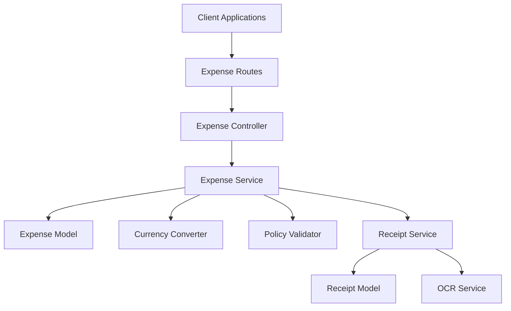

# Expense Management Service

## Table of Contents
- [Introduction](#introduction)
- [Features](#features)
  - [Expense Submission](#expense-submission)
  - [Policy and Compliance Engine](#policy-and-compliance-engine)
- [Architecture Overview](#architecture-overview)
- [Dependencies](#dependencies)
  - [Internal Dependencies](#internal-dependencies)
  - [External Dependencies](#external-dependencies)
- [Installation and Setup](#installation-and-setup)
- [Usage Guidelines](#usage-guidelines)
  - [API Endpoints](#api-endpoints)
- [Testing](#testing)
- [Contributing](#contributing)
- [License](#license)

## Introduction

The **Expense Management Service** is a core component of the Global Employee Travel Expense Tracking App. It is responsible for handling expense submissions, receipt processing, currency conversions, and policy compliance checks. This service enables employees to efficiently capture and submit travel expenses and ensures that all submissions adhere to company policies and international tax laws.

*This README provides a comprehensive guide for developers and maintainers to understand the service's architecture, dependencies, functionalities, setup instructions, and usage guidelines.*

## Features

The Expense Management Service addresses several key requirements outlined in the technical specification.

### Expense Submission

**Description:** Enable employees to efficiently capture and submit travel expenses through user-friendly mobile and web interfaces, incorporating automated data extraction and currency support.

- **Requirements Addressed:**
  - **TR-F002.1:** Provide a mobile app for easy expense capture on-the-go.
    - *Location:* Technical Specification [13.2 Expense Submission > TR-F002.1](#)
  - **TR-F002.2:** Utilize OCR technology for automatic receipt scanning and data extraction.
    - *Location:* Technical Specification [13.2 Expense Submission > TR-F002.2](#)
  - **TR-F002.3:** Support multiple currencies with real-time conversion.
    - *Location:* Technical Specification [13.2 Expense Submission > TR-F002.3](#)
  - **TR-F002.4:** Allow attachment of digital receipts or photos of physical receipts.
    - *Location:* Technical Specification [13.2 Expense Submission > TR-F002.4](#)
  - **TR-F002.5:** Categorize expenses (e.g., meals, transportation, lodging).
    - *Location:* Technical Specification [13.2 Expense Submission > TR-F002.5](#)
  - **TR-F002.8:** Provide an offline mode for expense entry when internet connection is unavailable.
    - *Location:* Technical Specification [13.2 Expense Submission > TR-F002.8](#)

### Policy and Compliance Engine

**Description:** Ensure all expense submissions adhere to company policies and international tax laws through configurable rules and real-time validation.

- **Requirements Addressed:**
  - **TR-F003.1:** Configure expense policies based on employee level, department, and travel destination.
    - *Location:* Technical Specification [13.3 Policy and Compliance Engine > TR-F003.1](#)
  - **TR-F003.2:** Perform real-time policy checks during expense submission.
    - *Location:* Technical Specification [13.3 Policy and Compliance Engine > TR-F003.2](#)
  - **TR-F003.3:** Integrate with global tax databases to maintain up-to-date tax laws.
    - *Location:* Technical Specification [13.3 Policy and Compliance Engine > TR-F003.3](#)
  - **TR-F003.5:** Flag expenses that exceed policy limits or require additional approval.
    - *Location:* Technical Specification [13.3 Policy and Compliance Engine > TR-F003.5](#)

## Architecture Overview

The service is built with **Node.js** and **Express**, following a modular architecture to enhance scalability and maintainability. It interacts with a **MongoDB** database to store expenses and receipts data.

**Key Components:**

- **Models:** Define the data structures for expenses and receipts.
- **Controllers:** Handle HTTP requests and responses.
- **Services:** Contain business logic for processing expenses and receipts.
- **Utilities:** Provide helper functions for currency conversion and policy validation.
- **Middlewares:** Manage authentication and error handling.

**High-Level Module Interaction:**



## Dependencies

### Internal Dependencies

The service relies on internal modules that encapsulate specific functionalities.

- **`Expense Model`** (`src/models/expenseModel.ts`)
  - Defines the schema for expense documents in MongoDB.
  - **Purpose:** Manage expense data, including amounts, categories, dates, and associated receipts.
  - **Requirements Addressed:**
    - Supports expense categorization (**TR-F002.5**).
    - Captures expense details for submission (**TR-F002.1**, **TR-F002.4**).

- **`Receipt Model`** (`src/models/receiptModel.ts`)
  - Defines the schema for receipt documents.
  - **Purpose:** Store receipt images and extracted data from OCR processing.
  - **Requirements Addressed:**
    - Facilitates attachment and management of digital receipts (**TR-F002.4**, **TR-F002.2**).

- **`Currency Converter`** (`src/utils/currencyConverter.ts`)
  - Provides functions to convert amounts between different currencies.
  - **Purpose:** Enable real-time currency conversion during expense submission.
  - **Requirements Addressed:**
    - Supports multiple currencies (**TR-F002.3**).
  - **Note:** Integrates with external currency exchange rate providers.

- **`Policy Validator`** (`src/utils/policyValidator.ts`)
  - Validates expenses against company policies.
  - **Purpose:** Ensure compliance with configured expense policies during submission.
  - **Requirements Addressed:**
    - Real-time policy checks (**TR-F003.2**).
    - Flags policy violations (**TR-F003.5**).

- **`Authenticate Middleware`** (`src/middlewares/authMiddleware.ts`)
  - Verifies JSON Web Tokens and user roles.
  - **Purpose:** Secure API endpoints by authenticating and authorizing requests.
  - **Related Requirements:**
    - Enforces role-based access control (**TR-F001.3**).

- **`Error Handler Middleware`** (`src/middlewares/errorMiddleware.ts`)
  - Centralizes error handling for the application.
  - **Purpose:** Send consistent error responses and log errors.

- **`Expense Service`** (`src/services/expenseService.ts`)
  - Contains business logic for creating and managing expenses.
  - **Purpose:** Process expense submissions and interact with the database.
  - **Requirements Addressed:**
    - Manages expense data storage (**TR-F002.1**, **TR-F002.5**).

- **`Receipt Service`** (`src/services/receiptService.ts`)
  - Processes receipt images and handles OCR tasks.
  - **Purpose:** Extract data from receipts to auto-fill expense details.
  - **Requirements Addressed:**
    - Implements OCR processing (**TR-F002.2**).

- **`OCR Service`** (`src/services/ocrService.ts`)
  - Integrates with OCR libraries or APIs.
  - **Purpose:** Provide OCR functionalities for receipt processing.
  - **Requirements Addressed:**
    - Automates data extraction from receipts (**TR-F002.2**).

- **`Expense Controller`** (`src/controllers/expenseController.ts`)
  - Handles API requests related to expenses.
  - **Purpose:** Define endpoints for creating, retrieving, and managing expenses.

- **`Receipt Controller`** (`src/controllers/receiptController.ts`)
  - Handles API requests related to receipts.
  - **Purpose:** Define endpoints for uploading receipts and retrieving receipt data.

- **`Expense Routes`** (`src/routes/expenseRoutes.ts`)
  - Defines the routing for expense-related endpoints.
  - **Purpose:** Map HTTP methods and paths to controller actions.

- **`Receipt Routes`** (`src/routes/receiptRoutes.ts`)
  - Defines the routing for receipt-related endpoints.
  - **Purpose:** Map HTTP methods and paths to controller actions.

### External Dependencies

The service utilizes various third-party packages:

- **`mongoose`** (version 5.13.8)
  - **Purpose:** Interface with MongoDB using object models.
  - **Usage:** Define schemas and interact with the database.

- **`axios`** (version ^0.21.1)
  - **Purpose:** Perform HTTP requests to external APIs.
  - **Usage:** Fetch currency exchange rates, tax information.

- **`express`** (version ^4.17.1)
  - **Purpose:** Web framework for Node.js.
  - **Usage:** Create the API server and define middleware.

- **`jsonwebtoken`** (version 8.5.1)
  - **Purpose:** Handle JSON Web Token creation and verification.
  - **Usage:** Implement authentication and secure endpoints.

- **`tesseract.js`** (version ^2.1.1)
  - **Purpose:** Perform OCR on images.
  - **Usage:** Extract text from receipt images.

## Installation and Setup

### Prerequisites

- **Node.js** (version 14.x or higher)
- **npm** (version 6.x or higher)
- **MongoDB** (local or remote instance)
- API keys for:
  - **Currency Exchange Service** (e.g., OpenExchangeRates)
  - **Tax Database Service** (e.g., Avalara)
  - **OCR Service** (if using an external OCR API)

### Setup Steps

1. **Clone the Repository**

   ```bash
   git clone https://github.com/your-organization/expense-management-service.git
   ```

2. **Navigate to the Service Directory**

   ```bash
   cd expense-management-service
   ```

3. **Install Dependencies**

   ```bash
   npm install
   ```

4. **Configure Environment Variables**

   Create a `.env` file in the root directory with the following variables:

   ```env
   PORT=3000
   MONGODB_URI=mongodb://localhost:27017/expense-management
   JWT_SECRET=your_jwt_secret
   CURRENCY_API_KEY=your_currency_api_key
   TAX_API_KEY=your_tax_api_key
   ```

5. **Run the Application**

   ```bash
   npm start
   ```

6. **Seed the Database**

   (Optional) Seed the database with initial data if necessary.

   ```bash
   npm run seed
   ```

## Usage Guidelines

### API Endpoints

The service exposes the following primary endpoints:

- **Expense Endpoints**

  - `POST /expenses`
    - **Description:** Submit a new expense.
    - **Requirements Addressed:** Expense submission (**TR-F002.1**, **TR-F002.4**).
  - `GET /expenses/:id`
    - **Description:** Retrieve details of a specific expense.
  - `GET /expenses`
    - **Description:** Retrieve a list of expenses.

- **Receipt Endpoints**

  - `POST /receipts`
    - **Description:** Upload a receipt image.
    - **Requirements Addressed:** Receipt attachment and OCR processing (**TR-F002.2**, **TR-F002.4**).
  - `GET /receipts/:id`
    - **Description:** Retrieve receipt details, including extracted data.

**Note:** All endpoints require authentication using JWT tokens.

### Authentication

- The service uses JWT for authenticating API requests.
- Include the JWT in the `Authorization` header as `Bearer <token>`.

### Error Handling

- The service returns errors with appropriate HTTP status codes and messages.
- Common error codes include `400 Bad Request`, `401 Unauthorized`, `403 Forbidden`, and `500 Internal Server Error`.

## Testing

### Running Tests

- The test suite includes unit and integration tests.
- Execute tests using the following command:

  ```bash
  npm test
  ```

### Test Coverage

- Tests cover models, services, controllers, and utilities.
- Ensure that new code is accompanied by tests to maintain coverage.

## Contributing

We appreciate contributions from the community.

- **Guidelines:**
  - Follow the existing code style and conventions.
  - Write tests for new features or bug fixes.
  - Document your code and update the README if necessary.
- **Process:**
  - Fork the repository.
  - Create a new branch for your feature or bugfix.
  - Submit a pull request with a detailed description of your changes.

## License

The Expense Management Service is released under the **MIT License**. See the [LICENSE](LICENSE) file for details.